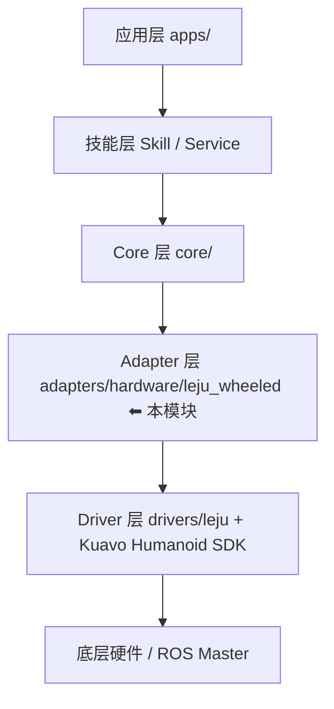
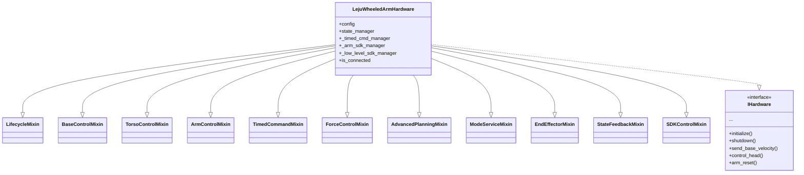
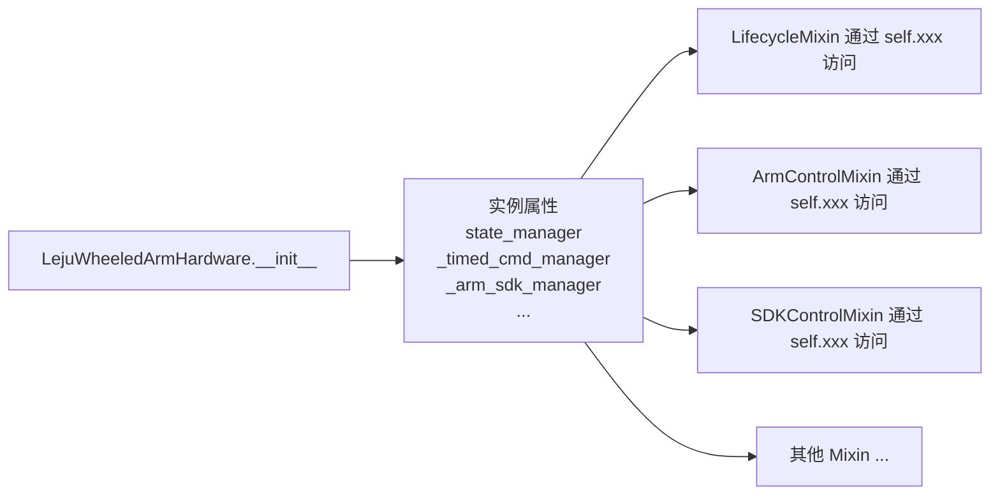
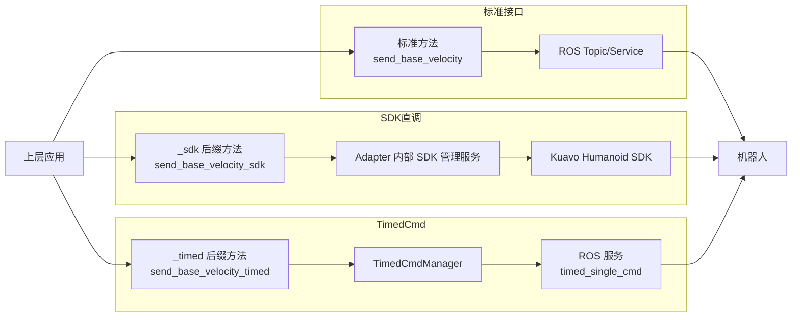
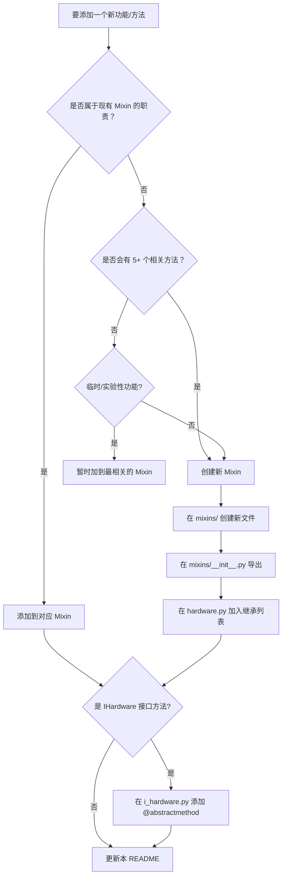

# 乐聚轮臂机器人硬件适配器

> **路径**：`LeTools/adapters/hardware/leju_wheeled/`
> **接口**：`core.interfaces.i_hardware.IHardware`
> **维护者**：硬件适配团队

本目录是 **乐聚轮臂机器人 (Leju Wheeled Arm Robot)** 的硬件适配层实现，负责将上层应用的标准接口调用，转换为底层硬件能识别的 **ROS 话题/服务调用** 或 **Kuavo Humanoid SDK 调用**。

---

## 📑 目录

1. [模块概览](#1-模块概览)
2. [目录结构](#2-目录结构)
3. [架构设计（Mixin 模式）](#3-架构设计mixin-模式)
4. [Mixin 职责矩阵](#4-mixin-职责矩阵)
5. [三模式控制说明](#5-三模式控制说明)
6. [方法命名规范](#6-方法命名规范)
7. [快速开始](#7-快速开始)
8. [共享状态字段说明](#8-共享状态字段说明)
9. [ROS 话题/服务清单](#9-ros-话题服务清单)
10. [添加新功能指南](#10-添加新功能指南)
11. [常见陷阱与注意事项](#11-常见陷阱与注意事项)
12. [测试与调试](#12-测试与调试)
13. [变更历史](#13-变更历史)
14. [TODO / 已知问题](#14-todo--已知问题)

---

## 1. 模块概览

### 1.1 在整个架构中的位置



- **本模块属于 Adapter 层**，承上启下：
  - **承上**：实现 `IHardware` 接口，向 Core/Skill 层暴露**统一、机器人无关**的标准方法
  - **启下**：调用 ROS 话题/服务、Kuavo SDK、以及 `drivers/leju/end_effector` 等驱动

### 1.2 核心能力

| 能力 | 说明 |
|------|------|
| 底盘控制 | 速度 / 位置（世界系或本体系） |
| 躯干控制 | 6 自由度位姿、焦点切换 |
| 手臂控制 | 单/双臂末端笛卡尔位姿、14 关节轨迹 |
| 腿部控制 | 4 关节位置控制 |
| 时序指令 | 带时间参数的精确控制（planner_index 0–9） |
| 离线轨迹 | 预定义复杂轨迹、Ruckig 参数调节 |
| IK 求解 | 目标位姿可达性检查 |
| 模式管理 | MPC 模式、快速模式、手臂控制模式 |
| 末端执行器 | 夹爪 / 灵巧手统一接口 |
| 状态反馈 | 关节力矩、加速度、末端位姿、到达时间 |
| 头部控制 | yaw/pitch 控制 |
| 力控 | 期望力施加/撤销、挥空检测 |

---

## 2. 目录结构

```
leju_wheeled/
├── README.md                          # 📖 本文档
├── hardware.py                        # 主类 LejuWheeledArmHardware（仅 ~130 行，组装所有 Mixin）
├── camera.py                          # 相机底层封装
├── camera_adapter.py                  # 相机适配器（封装为统一接口）
├── perception_adapter.py              # 感知适配器（AprilTag 等）
├── mixins/                            # 🧩 所有功能 Mixin
│   ├── __init__.py                    # 统一导出
│   ├── _logging_setup.py              # 日志重配置工具（独立函数）
│   ├── lifecycle_mixin.py             # 初始化 / 关闭
│   ├── base_control_mixin.py          # 底盘速度/位置控制（ROS 话题）
│   ├── torso_control_mixin.py         # 躯干位姿 + 焦点切换
│   ├── arm_control_mixin.py           # 单/双臂末端、关节、腿部
│   ├── timed_command_mixin.py         # 时序指令 send_timed_*
│   ├── force_control_mixin.py         # 末端期望力控制（ROS 话题，对齐 LBForceController）
│   ├── advanced_planning_mixin.py     # Ruckig / 离线轨迹 / IK 可达性
│   ├── mode_service_mixin.py          # MPC / 快速 / 手臂控制模式
│   ├── end_effector_mixin.py          # 末端执行器（夹爪/灵巧手）
│   ├── state_feedback_mixin.py        # 状态查询
│   └── sdk_control_mixin.py           # Adapter 内部 SDK 调用 + control_head/arm_reset 等
├── hardware copy.py                   # ⚠️ 历史备份，保留参考，**勿被自动导入**
├── hardware.py.bak                    # ⚠️ 重构前完整备份（2025 年 Mixin 拆分时生成）
└── __pycache__/                       # Python 缓存目录（可随时删除）
```

> **关于备份文件**：`hardware copy.py` 和 `hardware.py.bak` 仅作历史参考，**不会被 Python 导入**（包内只 export `hardware.py` 中的 `LejuWheeledArmHardware`）。在确认新结构稳定后可以删除。

---

## 3. 架构设计（Mixin 模式）

### 3.1 为什么用 Mixin 模式？

原始的 `hardware.py` 单文件超过 **1900 行**，承担了 10 多种职责，是典型的"上帝类"反模式。我们通过 **Mixin 多继承** 重构，达到以下目标：

| 目标 | 实现方式 |
|------|---------|
| 单一职责 | 每个 Mixin 只负责一个领域 |
| 零行为变更 | 方法签名、调用方式完全不变 |
| 保持单一对象 | 仍然实现 `IHardware`，上层无需感知 |
| 共享状态 | 通过 `self.xxx` 访问主类初始化的属性 |
| 易于协作 | 不同人可同时修改不同 Mixin，避免冲突 |

### 3.2 类继承关系



### 3.3 MRO（方法解析顺序）约定

在 `hardware.py` 中：

```python
class LejuWheeledArmHardware(
    LifecycleMixin,
    BaseControlMixin,
    TorsoControlMixin,
    ArmControlMixin,
    TimedCommandMixin,
    ForceControlMixin,
    AdvancedPlanningMixin,
    ModeServiceMixin,
    EndEffectorMixin,
    StateFeedbackMixin,
    SDKControlMixin,
    IHardware,  # ⬅ 必须放在最后
):
```

**规则**：
1. **所有 Mixin 在前**，`IHardware` 抽象类放在**最后**，确保 Mixin 中的具体实现优先于 `IHardware` 的抽象方法
2. **Mixin 之间互相独立**，不应有直接继承关系（避免 MRO 复杂化）
3. **Mixin 之间允许调用对方方法**（通过 `self.xxx()`），因为最终都聚合到同一个对象上

### 3.4 共享状态规则

所有 Mixin 共享主类 `__init__` 中创建的状态：



**禁止**：
- ❌ Mixin 中**不应**定义 `__init__`（避免 MRO 调用混乱）
- ❌ Mixin 中**不应**重新初始化主类的状态字段
- ❌ Mixin 之间**不应**直接 `import` 对方（应通过 `self.xxx()` 互相调用）

---

## 4. Mixin 职责矩阵

| Mixin | 行数 | 主要方法 | 控制方式 | 依赖资源 |
|-------|------|---------|---------|---------|
| **LifecycleMixin** | 185 | `initialize()`, `shutdown()`, `_initialize_sdk_managers()` | — | rospy, StateManager, SDK 管理器 |
| **BaseControlMixin** | 229 | `send_base_velocity()`, `send_base_pose()`, `publish_cmd_vel()`, `send_base_position()`, `send_world_position()` | ROS 话题 | `/cmd_vel`, `/cmd_pose`, `/cmd_pose_world` |
| **TorsoControlMixin** | 182 | `send_torso_pose()`, `reset_torso_to_initial()`, `set_focus_ee()`, `set_focus_z()`, `send_torso_pose_impl()` | ROS 话题 + 服务 | `/cmd_lb_torso_pose`, `/mobile_manipulator_reset_torso` |
| **ArmControlMixin** | 351 | `send_ee_pose()`, `send_both_ee_poses()`, `send_arm_joint_trajectory()`, `send_leg_joint_command()`, `send_two_arm_hand_pose()` | ROS 话题 | `/kuavo_arm_traj`, `/lb_leg_traj`, `/mm/two_arm_hand_pose_cmd` |
| **TimedCommandMixin** | 314 | `send_timed_base_pose()`, `send_timed_torso_pose()`, `send_timed_leg_joint()`, `send_timed_left_arm_joint()`, `send_timed_right_arm_joint()`, `send_timed_multi_commands()` | ROS 服务 | `/mobile_manipulator_timed_single_cmd`, `/mobile_manipulator_timed_multi_cmd` |
| **ForceControlMixin** | 325 | `set_ee_force()`, `set_ee_force_both()`, `clear_ee_force()`, `set_external_wrench()`, `clear_external_wrench()`, `enable_force_empty_detect()`, `set_contact_force_params()` | ROS 话题 + 服务 | `/desired_ee_force/{left,right}`, `/external_wrench/{left_hand,right_hand}`, `/enable_force_empty_detact`, `/set_contact_force_params` |
| **AdvancedPlanningMixin** | 321 | `set_ruckig_planner_params()`, `set_offline_trajectory()`, `enable_offline_trajectory()`, `check_ik_accessibility()` | ROS 服务 | `/mobile_manipulator_set_ruckig_planner_params`, `/mobile_manipulator_timed_offline_traj`, `/mobile_manipulator_ik_accessibility_check` |
| **ModeServiceMixin** | 144 | `set_mpc_mode()`, `enable_quick_mode()`, `set_arm_quick_mode()`, `set_arm_control_mode()` | ROS 服务 | `/mobile_manipulator_mpc_control`, `/enable_lb_arm_quick_mode`, `/wheel_arm_change_arm_ctrl_mode` |
| **EndEffectorMixin** | 31 | `control_end_effector()` | Driver | `drivers.leju.end_effector.LejuEndEffector` |
| **StateFeedbackMixin** | 71 | `get_reach_time()`, `get_mpc_observation()`, `get_mpc_control_mode()`, `get_body_acceleration()`, `get_joint_torque()`, `get_ee_poses()` | StateManager 缓存 | `adapters.hardware.leju_wheeled.services.state_manager.StateManager` |
| **SDKControlMixin** | 393 | `send_base_velocity_sdk()`, `send_arm_joint_sdk()`, `control_head_sdk()`, `send_torso_pose_sdk()`, `send_leg_joint_sdk()`, `control_head()`, `arm_reset()` | Kuavo SDK | `adapters.hardware.leju_wheeled.services.sdk_manager.{TimedCmdManager, ArmSDKManager, LowLevelSDKManager}` |

### 4.1 Mixin 详细说明

#### LifecycleMixin
- **核心方法**：`initialize()` / `shutdown()`
- **关键流程**：
  1. 启动 ROS Node（`leju_wheeled_arm_hardware`）
  2. 调用 `reconfigure_logging_after_rospy_init()` 修复日志
  3. 初始化末端执行器（可选）
  4. 初始化相机适配器（可选，依赖 `config/camera_config.yaml`）
  5. 初始化 `StateManager`
  6. 初始化 3 个 SDK 管理器（可选，失败不影响主流程）

#### TimedCommandMixin
- **planner_index 对照表**：
  | index | 含义 | cmd_vec 维度 |
  |-------|------|-------------|
  | 0 | 底盘世界系位置 (x, y, yaw) | 3 |
  | 1 | 底盘局部系位置 | 3 |
  | 2 | 躯干笛卡尔 (x, z, yaw, pitch) | 4 |
  | 3 | 下肢关节 | 4 |
  | 4 | 左臂笛卡尔世界系 | 6 |
  | 5 | 右臂笛卡尔世界系 | 6 |
  | 6 | 左臂笛卡尔局部系 | 6 |
  | 7 | 右臂笛卡尔局部系 | 6 |
  | 8 | 左臂上肢关节 | 7 |
  | 9 | 右臂上肢关节 | 7 |

#### SDKControlMixin
- 包含两类方法：
  1. **`_sdk` 后缀方法**：直接调用 Adapter 内部 SDK 管理服务（高级用户）
  2. **IHardware 标准方法**：`control_head` / `arm_reset`，内部调用 `_sdk` 方法

> **注意**：`apply_arm_force` / `enable_force_empty_detect` 已迁移到独立的 **ForceControlMixin**（ROS 话题路径），详见第 4 章 Mixin 职责矩阵。

---

## 5. 三模式控制说明

本适配器支持 **3 种控制方式**，覆盖不同场景需求：



### 5.1 三种模式对比

| 维度 | 标准接口（ROS 话题） | SDK 直调（`_sdk`） | TimedCmd（`_timed`） |
|------|---------------------|--------------------|----------------------|
| 方法命名 | 无后缀 | `_sdk` 后缀 | `_timed` 后缀 |
| 底层路径 | ROS 话题/服务 | Adapter 内部 SDK 管理服务 → Kuavo SDK | TimedCmdAPI → ROS 服务 |
| 控制精度 | 一般（受话题频率限制） | 较高（可 100Hz 循环） | 高（带时间参数规划） |
| 角度单位 | 弧度 (rad) | 度 (deg) | 弧度 (rad) |
| 适用场景 | 通用控制、Skill 编排 | 高频循环、力控、底层调试 | 精确时序、轨迹规划、Ruckig |
| 易用性 | ✅ 简单 | ⚠️ 需理解 MPC 模式和循环频率 | ⚠️ 需理解 planner_index |
| 所属 Mixin | BaseControl / Arm / Torso / ... | SDKControlMixin | TimedCommandMixin |

### 5.2 如何选择？

- **默认推荐**：**标准接口**（无后缀），适合大多数场景和 Skill 编排
- **精确时序**：需要带时间参数的运动规划时，使用 **TimedCmd**（`_timed` 后缀）
- **底层控制**：需要高频循环（100Hz）或力控时，使用 **SDK 直调**（`_sdk` 后缀）
- **混合使用**：可以混用，但要注意 MPC 模式切换的状态管理

---

## 6. 方法命名规范

### 6.1 命名约定速查表

| 后缀/前缀 | 含义 | 示例 | 调用方 |
|----------|------|------|--------|
| 无后缀 | **标准接口方法**（实现 IHardware） | `send_base_velocity()` | 上层应用、Skill |
| `_sdk` 后缀 | **SDK 模式方法**（调用 Adapter 内部 SDK 管理服务） | `send_base_velocity_sdk()` | 高级用户、底层测试 |
| `_impl` 后缀 | **内部实现辅助方法** | `send_torso_pose_impl()` | 仅同一 Mixin 内调用 |
| `_` 前缀 | **私有方法/属性** | `_initialize_sdk_managers()`, `_timed_cmd_manager` | 仅类内部使用 |

### 6.2 单位约定

⚠️ **不同命名风格的方法有不同的单位约定，使用时务必注意：**

| 方法类型 | 角度单位 | 示例 |
|---------|---------|------|
| 标准接口方法（IHardware 中定义） | **弧度 (rad)** | `control_head(yaw=0.5, pitch=0.3)` |
| `_sdk` 后缀方法（暴露给用户） | **度 (deg)** | `control_head_sdk(yaw_deg=30, pitch_deg=15)` |
| 时序指令内部 | **弧度 (rad)** | 上层传度，内部自动转弧度 |
| 关节角度（手臂/腿部）| **度 (deg)**（已混入约定） | `send_arm_joint_trajectory([0, 30, ...])` |

**线性单位统一为米 (m)**，时间统一为秒 (s)。

### 6.3 frame 参数映射

| Core 标准 `FrameType` | 双臂位姿 `leju_frame` | 时序指令 `planner_index` 增量 |
|----------------------|---------------------|-----------------------------|
| `FrameType.WORLD` | 1 | 0（世界系） |
| `FrameType.LOCAL` | 2 | 1（局部系） |

---

## 7. 快速开始

### 7.1 标准接口（推荐，ROS 话题/服务）

```python
from adapters.hardware.factory import HardwareFactory
from core.domain.enums import FrameType, ArmSide
from core.domain.pose import Pose6D

hw = HardwareFactory.create_hardware(config={'robot_type': 'leju_wheeled'})
hw.initialize()

# 头部 / 手臂
hw.control_head(yaw=0.0, pitch=0.3)              # 单位：弧度
hw.arm_reset()                                    # 手臂归位

# 底盘
hw.send_base_velocity(vx=0.2, vy=0.0, vyaw=0.0)  # 持续 5 秒

# 双臂末端
left = Pose6D(x=0.3, y=0.3, z=0.8, roll=0, pitch=0, yaw=0)
right = Pose6D(x=0.3, y=-0.3, z=0.8, roll=0, pitch=0, yaw=0)
hw.send_both_ee_poses(left, right, frame=FrameType.WORLD)

# 状态查询
reach_time = hw.get_reach_time('cmd_pose')
print(f"上次底盘指令的到达时间: {reach_time}s")

hw.shutdown()
```

### 7.2 SDK 直调（高级，Kuavo SDK API）

```python
# 头部 / 底盘
hw.control_head_sdk(yaw_deg=0.0, pitch_deg=15.0)  # 单位：度
hw.send_base_velocity_sdk(vx=0.2, vy=0.0, vyaw=0.0, frame=FrameType.LOCAL)

# 躯干（需 100Hz 循环调用）
import time
for _ in range(300):
    hw.send_torso_pose_sdk(x=0.1, z=0.0, yaw=0.0, pitch=0.0)
    time.sleep(0.01)

# MPC 模式切换
hw.set_mpc_mode_sdk('ArmOnly')
```

### 7.3 TimedCmd（精确时序控制）

```python
from core.domain.enums import FrameType

# 底盘（desire_time=1.0 内置）
hw.send_base_velocity_timed(vx=0.3, vy=0.0, vyaw=0.0, frame=FrameType.WORLD)

# 双臂末端世界系（12D 合并：左6D + 右6D）
hw.send_arm_ee_world_timed(
    left_pose=[0.3, 0.25, 0.5, 0, 0, 0],
    right_pose=[0.3, -0.25, 0.5, 0, 0, 0],
    desire_time=3.0
)

# Ruckig 规划器参数
hw.set_ruckig_params_timed(
    planner_index=0, is_sync=True,
    velocity_max=[0.2, 0.2, 0.2],
    acceleration_max=[2.0, 2.0, 1.5],
    jerk_max=[20.0, 15.0, 12.0]
)

# 离线轨迹
hw.set_offline_trajectory_timed(trajectories=[{
    'planner_index': 0, 'frame': 0,
    'timed_traj': [
        {'desire_time': 0.0, 'cmd_vec': [0.3, 0.2, 0.3, 0.0, 0.0, 0.0]},
        {'desire_time': 3.0, 'cmd_vec': [0.6, 0.2, 0.45, 0.3, 0.0, 0.0]},
    ],
}])
hw.enable_offline_trajectory_timed(enable=True)
```

### 7.4 通过 HardwareFactory 创建（推荐）

```python
from adapters.hardware.factory import HardwareFactory

hw = HardwareFactory.create_hardware(config={'robot_type': 'leju_wheeled'})
hw.initialize()
# ... 使用任意模式 ...
hw.shutdown()
```

---

## 8. 共享状态字段说明

以下字段在 `LejuWheeledArmHardware.__init__` 中初始化，所有 Mixin 均可通过 `self.xxx` 访问：

| 字段名 | 类型 | 初始化时机 | 使用方 |
|--------|------|-----------|--------|
| `config` | `dict` | `__init__` | 所有 Mixin |
| `_end_effector` | `LejuEndEffector` | `__init__` | LifecycleMixin, EndEffectorMixin |
| `_connected` | `bool` | `__init__` (False) | `is_connected` 属性 |
| `camera` | `CameraAdapter` 或 None | LifecycleMixin.initialize | 外部访问 |
| `perception` | `PerceptionAdapter` 或 None | LifecycleMixin.initialize | 外部访问 |
| `state_manager` | `StateManager` 或 None | LifecycleMixin.initialize | StateFeedbackMixin, 各种 Mixin 写入 reach_time |
| `_timed_cmd_manager` | `TimedCmdManager` 或 None | LifecycleMixin._initialize_sdk_managers | SDKControlMixin |
| `_arm_sdk_manager` | `ArmSDKManager` 或 None | LifecycleMixin._initialize_sdk_managers | SDKControlMixin |
| `_low_level_sdk_manager` | `LowLevelSDKManager` 或 None | LifecycleMixin._initialize_sdk_managers | SDKControlMixin |
| `_observation` | Any | `__init__` (None) | 内部观测缓存 |
| `_observation_mutex` | `threading.Lock` | `__init__` | 多线程同步 |
| `_observation_sub` | Any | `__init__` (None) | ROS 订阅器引用 |
| `_two_arm_hand_pose_pub` | `rospy.Publisher` 或 None | ArmControlMixin.send_two_arm_hand_pose | 双臂位姿发布器缓存 |
| `_pub_desired_ee_force_left` | `rospy.Publisher` | ForceControlMixin._init_force_publishers | 左手期望力发布器 |
| `_pub_desired_ee_force_right` | `rospy.Publisher` | ForceControlMixin._init_force_publishers | 右手期望力发布器 |
| `_pub_external_wrench_left` | `rospy.Publisher` | ForceControlMixin._init_force_publishers | 左手仿真外力发布器 |
| `_pub_external_wrench_right` | `rospy.Publisher` | ForceControlMixin._init_force_publishers | 右手仿真外力发布器 |
| `_pub_force_empty_detact` | `rospy.Publisher` | ForceControlMixin._init_force_publishers | 挥空检测开关发布器（latch） |
| `_current_yaw` | `float` | `__init__` (0.0) | 当前偏航角缓存 |

---

## 9. ROS 话题/服务清单

### 9.1 发布的话题（Publishers）

| Topic | 消息类型 | 用途 | 所属 Mixin |
|-------|---------|------|-----------|
| `/cmd_vel` | `geometry_msgs/Twist` | 底盘速度（需持续发布） | BaseControlMixin |
| `/cmd_pose` | `geometry_msgs/Twist` | 底盘位置（本体系） | BaseControlMixin |
| `/cmd_pose_world` | `geometry_msgs/Twist` | 底盘位置（世界系） | BaseControlMixin |
| `/cmd_lb_torso_pose` | `geometry_msgs/Twist` | 躯干位姿 | TorsoControlMixin |
| `/mobile_manipulator_focus_ee` | `std_msgs/Bool` | 焦点切换（末端） | TorsoControlMixin |
| `/mobile_manipulator_focus_z` | `std_msgs/Bool` | 焦点切换（Z 轴） | TorsoControlMixin |
| `/kuavo_arm_traj` | `sensor_msgs/JointState` | 手臂关节轨迹 | ArmControlMixin |
| `/lb_leg_traj` | `sensor_msgs/JointState` | 腿部关节轨迹 | ArmControlMixin |
| `/mm/two_arm_hand_pose_cmd` | `kuavo_msgs/twoArmHandPoseCmd` | 双臂手部位姿 | ArmControlMixin |
| `/desired_ee_force/left` | `geometry_msgs/WrenchStamped` | 左手期望力（3D 力 + 3D 力矩） | ForceControlMixin |
| `/desired_ee_force/right` | `geometry_msgs/WrenchStamped` | 右手期望力（3D 力 + 3D 力矩） | ForceControlMixin |
| `/external_wrench/left_hand` | `geometry_msgs/Wrench` | 左手仿真外力 | ForceControlMixin |
| `/external_wrench/right_hand` | `geometry_msgs/Wrench` | 右手仿真外力 | ForceControlMixin |
| `/enable_force_empty_detact` | `std_msgs/Bool` | 挥空检测开关（latch） | ForceControlMixin |

### 9.2 订阅的话题（Subscribers）

| Topic | 消息类型 | 用途 | 所属 Mixin |
|-------|---------|------|-----------|
| `/lb_cmd_pose_reach_time` | `std_msgs/Float32` | 底盘到达时间反馈 | BaseControlMixin |
| `/lb_torso_pose_reach_time` | `std_msgs/Float32` | 躯干到达时间反馈 | TorsoControlMixin |
| `/lb_arm_joint_reach_time/left` | `std_msgs/Float32` | 手臂到达时间反馈 | ArmControlMixin |
| `/lb_leg_joint_reach_time` | `std_msgs/Float32` | 腿部到达时间反馈 | ArmControlMixin |

### 9.3 调用的服务（Service Clients）

| Service | 类型 | 用途 | 所属 Mixin |
|---------|------|------|-----------|
| `/mobile_manipulator_reset_torso` | `std_srvs/SetBool` | 躯干归位 | TorsoControlMixin |
| `/mobile_manipulator_timed_single_cmd` | `kuavo_msgs/lbTimedPosCmd` | 单条时序指令 | TimedCommandMixin |
| `/mobile_manipulator_timed_multi_cmd` | `kuavo_msgs/lbMultiTimedPosCmd` | 多条时序指令 | TimedCommandMixin |
| `/mobile_manipulator_set_ruckig_planner_params` | `kuavo_msgs/setRuckigPlannerParams` | Ruckig 参数设置 | AdvancedPlanningMixin |
| `/mobile_manipulator_timed_offline_traj` | `kuavo_msgs/lbMultiTimedOfflineTraj` | 离线轨迹 | AdvancedPlanningMixin |
| `/mobile_manipulator_timed_offline_traj_enable` | `std_srvs/SetBool` | 启用/禁用离线轨迹 | AdvancedPlanningMixin |
| `/mobile_manipulator_ik_accessibility_check` | `kuavo_msgs/accessIkSolve` | IK 可达性检查 | AdvancedPlanningMixin |
| `/mobile_manipulator_mpc_control` | `kuavo_msgs/changeTorsoCtrlMode` | MPC 模式切换 | ModeServiceMixin |
| `/enable_lb_arm_quick_mode` | `kuavo_msgs/changeLbQuickModeSrv` | 快速模式切换 | ModeServiceMixin |
| `/wheel_arm_change_arm_ctrl_mode` | `kuavo_msgs/changeArmCtrlMode` | 手臂控制模式切换 | ModeServiceMixin |
| `/set_contact_force_params` | `kuavo_msgs/setContactForceInterpParams` | 接触力插值参数配置 | ForceControlMixin |

---

## 10. 添加新功能指南

### 10.1 决策流程图



### 10.2 添加到现有 Mixin

直接在对应 Mixin 文件中添加新方法即可：

```python LeTools/adapters/hardware/leju_wheeled/mixins/base_control_mixin.py
class BaseControlMixin:
    # ... existing methods ...

    def my_new_method(self, param: float) -> Result:
        """新方法的说明"""
        # 可以访问 self._timed_cmd_manager 等共享状态
        # 也可以调用其他 Mixin 的方法（通过 self.xxx()）
        return Result.ok()
```

### 10.3 创建新 Mixin

**步骤 1**：在 `mixins/` 下创建新文件，例如 `vision_mixin.py`：

```python LeTools/adapters/hardware/leju_wheeled/mixins/vision_mixin.py
from core.domain.result import Result
from core.common.logger import get_logger

logger = get_logger(__name__)


class VisionMixin:
    """视觉相关功能。"""

    def detect_object(self, ...) -> Result:
        # ...
        pass
```

**步骤 2**：在 `mixins/__init__.py` 中导出：

```python LeTools/adapters/hardware/leju_wheeled/mixins/__init__.py
# ... existing imports ...
from .vision_mixin import VisionMixin

__all__ = [
    # ... existing ...
    'VisionMixin',
]
```

**步骤 3**：在 `hardware.py` 中加入继承列表（在 `IHardware` 之前）：

```python LeTools/adapters/hardware/leju_wheeled/hardware.py
from .mixins import (
    # ... existing ...
    VisionMixin,
)


class LejuWheeledArmHardware(
    # ... existing mixins ...
    VisionMixin,        # 新增
    IHardware,          # 必须保持在最后
):
    pass
```

**步骤 4**：（可选）如需作为标准接口，在 `core/interfaces/i_hardware.py` 中添加 `@abstractmethod`。

**步骤 5**：更新本 README 的[第 4 章 Mixin 职责矩阵](#4-mixin-职责矩阵)。

---

## 11. 常见陷阱与注意事项

### 🔴 严重陷阱

#### 1. `rospy.init_node()` 会清除自定义日志配置
`rospy.init_node()` 内部调用了 `logging.basicConfig()`，会**清除**我们注册的所有日志处理器。

**解决方案**：在 `LifecycleMixin.initialize` 中已自动调用 `reconfigure_logging_after_rospy_init()` 修复。如果你在其他地方调用 `rospy.init_node()`，需要手动调用此函数。

```python
from adapters.hardware.leju_wheeled.mixins._logging_setup import reconfigure_logging_after_rospy_init

rospy.init_node('my_node')
reconfigure_logging_after_rospy_init()  # ⬅ 必须！
```

#### 2. `cmd_vel` 速度命令需要持续发布
如果只发布**一次** Twist 消息，机器人在 **1 秒后会自动停止**（看门狗机制）。

**解决方案**：`send_base_velocity()` 默认会以 100Hz 持续发布 5 秒。若需自定义，使用 `publish_cmd_vel(duration=...)`。

#### 3. `send_torso_pose_sdk` / `send_leg_joint_sdk` 是单次调用
这两个 SDK 方法**只发送一次指令**，需要上层以 **100Hz 频率循环调用** 才能让机器人持续响应。

```python
# ❌ 错误：单次调用无效
hw.send_torso_pose_sdk(x=0.1, z=0.0, yaw=0.0, pitch=0.0)

# ✅ 正确：100Hz 循环
import time
for i in range(300):  # 100Hz × 3s = 300 次
    hw.send_torso_pose_sdk(x=0.1, z=0.0, yaw=0.0, pitch=0.0)
    time.sleep(0.01)
```

### 🟡 重要注意点

#### 4. 单位混乱
标准接口和 SDK 方法的单位**不一致**：

| 方法 | 单位 |
|------|------|
| `control_head(yaw, pitch)` | 弧度 |
| `control_head_sdk(yaw_deg, pitch_deg)` | 度 |
| `send_arm_joint_trajectory(positions)` | 度 |
| `send_timed_left_arm_joint(joint_angles)` | 度（内部转弧度） |

**建议**：使用 `numpy.deg2rad()` / `numpy.rad2deg()` 显式转换，避免混淆。

#### 5. SDK 管理器初始化失败
SDK 管理器是**可选组件**，初始化失败不影响 ROS 模式工作，但会导致所有 `_sdk` 方法返回 `Result.fail()`。

**判断方式**：检查 `hw._timed_cmd_manager is not None`。

#### 6. MPC 模式状态管理
切换控制方式（如从 ROS 模式切到 SDK 模式）时，可能需要先切换 MPC 模式：

```python
hw.set_mpc_mode_sdk('ArmOnly')   # 仅手臂控制
hw.set_mpc_mode_sdk('FullBody')  # 全身控制
hw.set_mpc_mode_sdk('NoControl') # 关闭控制
```

#### 7. 双臂位姿的角度顺序差异
- `Pose6D` 的角度顺序是 **(roll, pitch, yaw)**
- 但 `send_two_arm_hand_pose` 内部使用的 `[yaw, pitch, roll]` 顺序
- `send_both_ee_poses()` 已为你处理了这个映射，**直接用 Pose6D 即可**

#### 8. `send_base_pose` 不是非阻塞调用
该方法会**阻塞等待运动完成**（等待 `reach_time` 反馈 + 额外缓冲）。如需异步，请使用 `send_timed_base_pose()`。

### 🟢 一般注意事项

- **`hardware copy.py` 和 `hardware.py.bak`** 不要被自动导入，包内只 export `hardware.py`
- **`__pycache__/`** 出现旧版缓存导致行为异常时，删除它即可
- **末端执行器**：`control_end_effector()` 内部根据 `cmd` 类型自动选择夹爪还是灵巧手

---

## 12. 测试与调试

### 12.1 日志查看

日志文件保存在 `apps/test_kuavo_5w_app/log/`（默认）：

```bash
# 实时查看主日志
tail -f apps/test_kuavo_5w_app/log/kuavo_studio_*.log

# 只看错误日志
tail -f apps/test_kuavo_5w_app/log/kuavo_studio_error_*.log

# 按 Trace ID 过滤（每次启动都会生成唯一 Trace ID）
grep 'TRACE:abc12345' apps/test_kuavo_5w_app/log/kuavo_studio_*.log
```

日志格式（文件）：
```
[2025-01-15 10:30:45] [TRACE:abc12345] [INFO] [adapters/hardware/leju_wheeled/mixins/base_control_mixin.py:42] 发送底盘速度指令: vx=0.2
```

### 12.2 单独测试某个 Mixin

由于 Mixin 之间共享状态，单独实例化 Mixin 不可行。**推荐做法**：通过完整的 `LejuWheeledArmHardware` 测试，但只调用你关心的方法。

```python
# tests/test_base_control.py
import pytest
from adapters.hardware.leju_wheeled.hardware import LejuWheeledArmHardware

@pytest.fixture
def hw():
    h = LejuWheeledArmHardware()
    h.initialize()
    yield h
    h.shutdown()

def test_send_base_velocity(hw):
    result = hw.send_base_velocity(vx=0.0, vy=0.0, vyaw=0.0)
    assert result.success
```

### 12.3 不连接真实硬件的 Mock 测试

如需在没有 ROS Master 的环境测试，可 mock `rospy`：

```python
from unittest.mock import patch, MagicMock

@patch('adapters.hardware.leju_wheeled.mixins.base_control_mixin.rospy')
def test_publish_cmd_vel(mock_rospy):
    mock_rospy.Publisher.return_value = MagicMock()
    # ... 测试逻辑 ...
```

### 12.4 ROS 话题调试

```bash
# 查看正在发布的话题
rostopic list | grep -E 'cmd_|lb_|mm/'

# 监控某个话题
rostopic echo /cmd_vel

# 查看话题发布频率（用于验证 100Hz 循环）
rostopic hz /cmd_vel

# 调用服务进行调试
rosservice call /mobile_manipulator_mpc_control "control_mode: 1"
```

### 12.5 验证拆分后的等价性

如果对重构后的行为有疑虑，可以对比 `hardware.py.bak` 中的原始实现：

```bash
diff <(grep -E '^\s*def ' hardware.py.bak) <(cat mixins/*.py | grep -E '^\s*def ')
```

---

## 13. 变更历史

### 2025-05-XX：力控重构 — 新增 ForceControlMixin，对齐源脚本 LBForceController
- **背景**：原 `apply_arm_force` 仅支持 Z 方向力且走 TimedCmd 路径，`enable_force_empty_detect` 为占位实现，与源脚本行为不一致
- **方案**：
  - 新增 `ForceControlMixin`（325 行），通过 ROS 话题直接发布力控指令
  - `set_ee_force(side, force_kg, torque)` — 3D 力 + 3D 力矩，支持左/右/双侧
  - `set_ee_force_both(left_force_kg, right_force_kg, ...)` — 分别设置左右手力
  - `clear_ee_force(side)` — 显式清除期望力
  - `set_external_wrench(side, force_n, torque)` — 仿真外力控制
  - `clear_external_wrench(side)` — 清除仿真外力
  - `enable_force_empty_detect(enable)` — 真实实现（latch 话题发布）
  - `set_contact_force_params(transition_time, interpolation_speed)` — 接触力参数服务调用
  - 移除旧 `apply_arm_force`（原 1D Z 方向 TimedCmd 路径）
  - `IHardware` 接口新增 7 个力控抽象方法（Section 5.7）
- **对齐源脚本**：`kuavo-ros-opensource/src/demo/test_kuavo_wheel_real/armContactForce/lb_force_ctrl.py`

### 2025-01-XX：Mixin 拆分重构
- **背景**：`hardware.py` 单文件超过 1900 行，承担 10+ 种职责，维护困难
- **方案**：采用 **Mixin 多继承** 拆分为 10 个职责明确的 Mixin
- **影响**：
  - ✅ **零行为变更**：所有方法签名、调用方式完全一致
  - ✅ 主类从 1900 行减少到 ~130 行
  - ✅ 每个 Mixin 平均 200 行左右，易于维护
  - 📦 备份文件：`hardware.py.bak`（重构前完整版本）

### 2024-XX-XX：Phase 2 - SDK 管理器集成
- 引入 Adapter 内部 SDK 管理服务（TimedCmdManager / ArmSDKManager / LowLevelSDKManager）
- 新增 `_sdk` 后缀的高级控制方法
- 实现 `control_head` / `arm_reset` / `apply_arm_force` 等接口

### 2024-XX-XX：Phase 1 - 初始版本
- 基于 ROS 话题/服务实现 `IHardware` 接口
- 集成相机、感知、末端执行器适配器
- 引入 `StateManager` 进行状态缓存管理

---

## 14. TODO / 已知问题

### 🚧 待实现

- [ ] **`send_joint_trajectory`** 当前为占位（保留接口）
  - 位置：`mixins/arm_control_mixin.py`
  - 需从原始版本中迁移真实逻辑（如有需要）

- [ ] **`send_base_pose_sdk`** 当前使用速度控制模拟，因为 TimedCmdAPI 不直接支持位姿控制
  - 位置：`mixins/sdk_control_mixin.py`
  - 需寻找更合适的底层 API

### ⚠️ 已知限制

- **`send_base_pose` 是阻塞调用**：会等待运动完成（可能数秒）。如需非阻塞，使用 `send_timed_base_pose()`
- **`hardware copy.py`** 保留作为历史参考，但**不会被包导入**
- **SDK 管理器可选**：若初始化失败，所有 `_sdk` 方法将返回 `Result.fail`，但不影响 ROS 模式工作
- **手臂归位需要空间**：`arm_reset()` 过程中手臂会自由运动，确保周围 1m 内无障碍物

### 💡 未来改进方向

- [ ] 为每个 Mixin 编写单元测试（pytest）
- [ ] 引入类型检查（`mypy` strict mode）
- [ ] 为常用流程添加上下文管理器（如 `with hw.mpc_mode('ArmOnly'): ...`）
- [ ] 增加性能监控埋点（响应时间、ROS 消息丢失率等）
- [ ] 删除历史备份文件 `hardware copy.py` 和 `hardware.py.bak`（待稳定后）

---

## 📮 联系与维护

- 模块维护者：硬件适配团队
- 接口定义：`core/interfaces/i_hardware.py`
- 上层调用示例：`apps/test_kuavo_5w_app/`
- 相关文档：
  - SDK 管理器：`adapters/hardware/leju_wheeled/services/sdk_manager/`
  - 驱动层：`drivers/leju/`
  - Kuavo Humanoid SDK：参考 SDK 官方文档

> 💬 如发现 bug 或有改进建议，请先查阅[第 11 章 常见陷阱与注意事项](#11-常见陷阱与注意事项)，再提交 issue 或 PR。