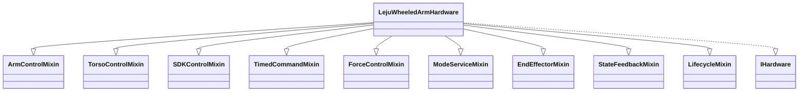

# 🤖 上半身控制接口文档（头部 / 手臂 / 躯干）

| 属性 | 值 |
|------|------|
| 📁 **代码路径** | `LeTools/adapters/hardware/leju_wheeled/` |
| 🔧 **适配器主类** | `LejuWheeledArmHardware`（通过 `HardwareFactory.create_hardware(...)` 创建） |
| 🤖 **适用机器人** | 乐聚轮臂机器人（Kuavo Wheeled Arm） |

---

本接口文档聚焦**头部、手臂、躯干**三个部位的所有控制接口：**头部**（2 DOF）、**手臂**（14 DOF）、**躯干**（4 DOF，含腰部/膝/腿关节，支持位姿坐标和关节角度两种控制模式）。每个接口都给出签名、参数说明、返回值、使用示例和注意事项，帮助你快速上手。

#### ⚠️ WARNING
在运行任何代码示例之前，请确保已经启动机器人，否则 SDK 和 ROS 话题无法正常工作：

- 仿真模式: `roslaunch humanoid_controllers load_kuavo_mujoco_sim.launch`
- 真实机器人: `roslaunch humanoid_controllers load_kuavo_real_wheel.launch`

---

## 📑 目录

1. [🏗️ 总体架构](#1-总体架构)
2. [🛤️ 三种控制路径](#2-三种控制路径)
3. [📐 核心概念](#3-核心概念)
4. [🗣️ 头部控制接口](#4-头部控制接口)
5. [🦾 手臂控制接口](#5-手臂控制接口)
6. [🦿 躯干控制接口](#6-躯干控制接口)
7. [⚡ 常用场景速查表](#7-常用场景速查表)
8. [🚀 快速开始示例](#8-快速开始示例)
9. [📋 附录：ROS 话题/服务清单](#9-附录ros-话题服务清单)

---

## 1. 🏗️ 总体架构

`LejuWheeledArmHardware` 采用 **Mixin 多继承** 设计，上半身与躯干相关功能分布在以下 Mixin 中：



| Mixin | 负责部位 | 控制路径 |
|-------|---------|---------|
| `ArmControlMixin` | 手臂末端位姿、关节轨迹、躯干关节 | ROS 话题 |
| `TorsoControlMixin` | 躯干位姿、焦点设置 | ROS 话题/服务 |
| `SDKControlMixin` | 头部、手臂 SDK（位姿+关节）、躯干 SDK（位姿+关节） | Kuavo SDK |
| `TimedCommandMixin` | 手臂/躯干时序指令 | ROS 服务 |
| `ForceControlMixin` | 手臂末端力控 | ROS 话题/服务 |
| `ModeServiceMixin` | 手臂控制模式、MPC 模式 | ROS 服务 |
| `EndEffectorMixin` | 末端执行器（夹爪/灵巧手） | ROS 服务/话题 |
| `StateFeedbackMixin` | 手臂/躯干状态查询 | StateManager 缓存 |
| `LifecycleMixin` | 初始化/关闭（含 SDK 管理器） | — |

底层依赖三个 SDK 管理器，在 `initialize()` 时并行初始化：

| 管理器 | 属性名 | 用途 |
|--------|--------|------|
| `TimedCmdManager` | `_timed_cmd_manager` | TimedCmd 路径（`_timed` 后缀方法） |
| `ArmSDKManager` | `_arm_sdk_manager` | 手臂 SDK 轨迹、手臂归位 |
| `LowLevelSDKManager` | `_low_level_sdk_manager` | 头部控制、躯干关节 SDK、底盘/躯干底层直调 |

#### 💡 NOTE
可通过 `config['skip_sdk_managers'] = True` 跳过 SDK 管理器初始化（仅用 ROS 话题），或用 `config['sdk_managers_whitelist'] = ['timed', 'arm']` 按需选择。

---

## 2. 🛤️ 三种控制路径

同一部位可以用不同"管道"控制，方法名后缀标识了路径：

| 后缀 | 路径 | 底层 | 特点 | 适用场景 |
|------|------|------|------|---------|
| 无后缀 | 标准接口 | ROS 话题/服务 | 最简单，自动阻塞等待完成 | 大多数场景 |
| `_sdk` | SDK 直调 | Kuavo Humanoid SDK | 高频（100Hz），需关注 MPC 模式 | 力控、底层调试、多关键点轨迹 |
| `_timed` | TimedCmd | ROS 服务（轨迹规划） | 带 `desire_time` 参数，精确控制时长 | 舞蹈、动作编排 |

#### 💡 NOTE
先用**标准接口**（无后缀），遇到精度/时序需求再看 `_sdk`/`_timed`。

---

## 3. 📐 核心概念

### 3.1 📐 角度单位

默认用**度（°）**，改成弧度需在创建时配 `angle_unit='rad'`。`Pose6D` 对象例外，始终用弧度。

```python
# 默认：度
hw = HardwareFactory.create_hardware(config={'robot_type': 'leju_wheeled'})

# 改为弧度
hw = HardwareFactory.create_hardware(config={
    'robot_type': 'leju_wheeled',
    'angle_unit': 'rad'
})
```

内部通过 `_to_rad()` 方法统一转换：度→弧度（×π/180），弧度→弧度（不变）。

#### ⚠️ WARNING
`Pose6D` 对象（用于 `send_ee_pose` / `send_both_ee_poses`）的姿态字段**始终是弧度**，不受 `angle_unit` 影响。如果手头是角度值，用 `Pose6D.from_euler(..., degrees=True)` 创建。

### 3.2 🧭 坐标系

| 枚举值 | 名称 | 说明 |
|--------|------|------|
| `FrameType.WORLD` (1) | 世界坐标系 | 基于 odom，机器人全局位置 |
| `FrameType.LOCAL` (2) | 本体坐标系 | 基于 base_link，机器人自身坐标系 |
| `FrameType.JOINT_SPACE` (5) | 关节空间 | 直接指定关节角度，不做 IK |
| `FrameType.KEEP_CURRENT` (0) | 保持当前 | 不改变坐标系 |

### 3.3 📤 返回值

所有控制类方法返回 `core.domain.result.Result` 对象：

| 字段 | 类型 | 说明 |
|------|------|------|
| `success` | bool | 是否成功 |
| `message` | str | 描述信息 |
| `data` | Any | 附加数据（如 `task_id`、`actual_time`、位姿字典、IK 求解详情等） |
| `error_code` | str 或 None | 可选错误码，方便上层做针对性处理 |

工厂方法：`Result.ok(msg="Success", data=None)` / `Result.fail(msg="Failed", error_code=None, data=None)`。

状态查询类方法（`get_*`）直接返回数据或 `None`（状态管理器未初始化时）。

### 3.4 📦 Pose6D 对象

`Pose6D` 是描述 6 自由度位姿的标准数据结构（`core/domain/pose.py`）：

| 字段 | 单位 | 说明 |
|------|------|------|
| `x`, `y`, `z` | 米 (m) | 末端位置 |
| `yaw` | 弧度 (rad) | 偏航角（绕 Z 轴旋转） |
| `pitch` | 弧度 (rad) | 俯仰角（绕 Y 轴旋转） |
| `roll` | 弧度 (rad) | 翻滚角（绕 X 轴旋转） |

`Pose6D` 的欧拉角顺序为 **yaw-pitch-roll (ZYX)**，与底层测试脚本一致。姿态字段始终为弧度，不受 `angle_unit` 配置影响。

#### 💡 NOTE
Pose6D 提供以下内置方法：`to_list()` → `[x, y, z, yaw, pitch, roll]`、`from_euler(x, y, z, yaw, pitch, roll, degrees=False)`（支持角度输入）、`to_quaternion()` → `(qx, qy, qz, qw)`。详见 [§5.8](#58-ik-可达性检查与数学工具)。

### 3.5 🔗 TransformMatrix 对象

`TransformMatrix` 是 4×4 齐次变换矩阵的封装（`core/domain/pose.py`），用于坐标系转换：

| 字段 | 类型 | 说明 |
|------|------|------|
| `matrix` | np.ndarray | 4×4 齐次变换矩阵 |

构造时自动校验矩阵形状，非 4×4 会抛出 `ValueError`。配合 `pose6d_to_matrix()` / `matrix_to_pose6d()` / `transform_pose()` 使用（见 [§5.8](#58-ik-可达性检查与数学工具)）。

---

## 4. 🗣️ 头部控制接口

> 所属：`SDKControlMixin` ｜ 底层：`LowLevelSDKManager.control_head`

头部具备 **yaw**（偏航，左右转头）和 **pitch**（俯仰，点头/抬头）两个自由度，通过 Kuavo SDK 路径下发。这是最简单的控制部位，适合用来验证适配器是否工作正常。

### 📋 接口总览

| 接口 | 说明 |
|:---|:---|
| [`control_head`](#control_head) | 控制头部 yaw/pitch 运动，阻塞等待完成 |
| [`control_head_sdk`](#control_head_sdk) | SDK 直调版本，底层实现一致，命名一致性保留 |

---

<details>
<summary id="control_head">🔧 <code>control_head(yaw: float, pitch: float) → Result</code></summary>

控制机器人的头部关节运动。

📥 **入参**

  * **yaw** (*float*) – 头部的偏航角，用户单位（默认度）。正值向左转，负值向右转。范围[-80, 80]度。
  * **pitch** (*float*) – 头部的俯仰角，用户单位（默认度）。正值低头，负值抬头。范围[-25, 25]度。

📤 **出参**

  如果头部控制成功返回 `Result.ok()`，否则返回 `Result.fail()`。

🏷️ **返回类型**

  `Result`（`.success=True/False`，`.message` 含结果或错误描述，`.data=None`）

```python
# 控制头部：向左转 10°，低头 5°
result = hw.control_head(yaw=10, pitch=5)
if result.success:
    print("头部控制成功")

# 归位
hw.control_head(yaw=0, pitch=0)
```

#### ⚠️ WARNING
头部控制依赖 `LowLevelSDKManager`，若初始化时设置了 `skip_sdk_managers=True` 则不可用。

</details>

<details>
<summary id="control_head_sdk">🔧 <code>control_head_sdk(yaw: float, pitch: float) → Result</code></summary>

SDK 直调版本的控制头部。底层实现与 `control_head` 完全一致（均走 `LowLevelSDKManager.control_head`），仅为命名一致性保留。

📥 **入参**
  * **yaw** (*float*) – 头部的偏航角，用户单位（默认度）。
  * **pitch** (*float*) – 头部的俯仰角，用户单位（默认度）。

📤 **出参**
  控制成功返回 `Result.ok()`，否则返回 `Result.fail()`。

🏷️ **返回类型**
  `Result`（`.success=True/False`，`.message` 含结果或错误描述，`.data=None`）

</details>

---

## 5. 🦾 手臂控制接口

手臂为 **7 自由度 × 2（左右共 14 DOF）**，支持末端笛卡尔位姿、关节空间、关节轨迹三种控制方式，横跨三种控制路径。

14 个关节的名称和顺序：

| 索引 | 关节名 | 所属部位 |
|------|--------|---------|
| 0 | `left_shoulder_pitch` | 左臂-肩部 |
| 1 | `left_shoulder_roll` | 左臂-肩部 |
| 2 | `left_shoulder_yaw` | 左臂-肩部 |
| 3 | `left_elbow_pitch` | 左臂-肘部 |
| 4 | `left_elbow_yaw` | 左臂-肘部 |
| 5 | `left_wrist_pitch` | 左臂-腕部 |
| 6 | `left_wrist_roll` | 左臂-腕部 |
| 7 | `right_shoulder_pitch` | 右臂-肩部 |
| 8 | `right_shoulder_roll` | 右臂-肩部 |
| 9 | `right_shoulder_yaw` | 右臂-肩部 |
| 10 | `right_elbow_pitch` | 右臂-肘部 |
| 11 | `right_elbow_yaw` | 右臂-肘部 |
| 12 | `right_wrist_pitch` | 右臂-腕部 |
| 13 | `right_wrist_roll` | 右臂-腕部 |

### 5.1 📍 末端位姿控制

> 所属：`ArmControlMixin` ｜ 话题：`/mm/two_arm_hand_pose_cmd`

"末端位姿"就是告诉机器人"手（末端执行器）到哪个空间位置、朝哪个方向"。用 `Pose6D` 对象描述，包含位置 (x, y, z) 和姿态 (yaw, pitch, roll)。


#### 📋 接口总览

| 接口 | 说明 |
|:---|:---|
| [`send_ee_pose`](#send_ee_pose) | 单臂手部笛卡尔位姿控制。调用单臂时，另一臂自动填充安全默认位姿（x=0.1, y=±0.3, z=0.7, yaw=0, pitch=0, roll=0，单位：... |
| [`send_both_ee_poses`](#send_both_ee_poses) | 双臂手部笛卡尔位姿控制，直接话题 `/mm/two_arm_hand_pose_cmd`。 |
| [`send_arm_ee_joint_space`](#send_arm_ee_joint_space) | 双臂关节空间控制，走 `/mm/two_arm_hand_pose_cmd` 的 frame=5 模式（不做 IK，直接用关节角度作为初值）。 |

---

<details>
<summary id="send_ee_pose">🔧 <code>send_ee_pose(side: ArmSide, pose: Pose6D, frame: FrameType = FrameType.WORLD) → Result</code></summary>


单臂手部笛卡尔位姿控制。调用单臂时，另一臂自动填充安全默认位姿（x=0.1, y=±0.3, z=0.7, yaw=0, pitch=0, roll=0，单位：米和弧度）。

📥 **入参**
  * **side** ([*ArmSide*]) – 手臂侧 (LEFT/RIGHT)。
  * **pose** ([*Pose6D*]) – 目标位姿，单位：米和弧度。Pose6D 的角度字段始终是弧度。
  * **frame** ([*FrameType*], *optional*) – 坐标系类型 (WORLD/LOCAL)，默认为 WORLD。

📤 **出参**
  指令发送成功返回 `Result.ok()`，否则返回 `Result.fail()`。

🏷️ **返回类型**
  `Result`（`.success=True/False`，`.message` 含结果或错误描述，`.data=None`）

#### 💡 NOTE
首次调用会自动等待 1.0s 建立 Publisher 连接（与源脚本时序一致）。方法会**阻塞等待**运动完成。

```python
from core.domain.pose import Pose6D
from core.domain.enums import ArmSide, FrameType

# 单臂控制：左手伸到前方
left_pose = Pose6D(x=0.3, y=0.2, z=0.8, yaw=0.0, pitch=0.0, roll=0.0)
hw.send_ee_pose(side=ArmSide.LEFT, pose=left_pose, frame=FrameType.WORLD)
```


</details>

<details>
<summary id="send_both_ee_poses">🔧 <code>send_both_ee_poses(left_pose: Pose6D, right_pose: Pose6D, frame: FrameType = FrameType.WORLD) → Result</code></summary>


双臂手部笛卡尔位姿控制，直接话题 `/mm/two_arm_hand_pose_cmd`。

📥 **入参**
  * **left_pose** ([*Pose6D*]) – 左手目标位姿，单位：米和弧度。
  * **right_pose** ([*Pose6D*]) – 右手目标位姿，单位：米和弧度。
  * **frame** ([*FrameType*], *optional*) – 坐标系类型 (WORLD=1 / LOCAL=2)，默认为 WORLD。

📤 **出参**
  指令发送成功返回 `Result.ok()`，否则返回 `Result.fail()`。

🏷️ **返回类型**
  `Result`（`.success=True/False`，`.message` 含结果或错误描述，`.data=None`）

#### 💡 NOTE
工作流程（内部自动完成）：
1. 将 `Pose6D` 的欧拉角转换为四元数
2. 构建 `twoArmHandPoseCmd` ROS 消息
3. 发布到 `/mm/two_arm_hand_pose_cmd` 话题
4. 订阅 `/lb_arm_ee_reach_time/left` 获取到达时间
5. **阻塞等待**运动完成（到达时间 + 0.5s 余量）

```python
right_pose = Pose6D(x=0.3, y=-0.2, z=0.8, yaw=0.0, pitch=0.0, roll=0.0)
hw.send_both_ee_poses(left_pose=left_pose, right_pose=right_pose)
```


</details>

<details>
<summary id="send_arm_ee_joint_space">🔧 <code>send_arm_ee_joint_space(left_joints_7: List[float], right_joints_7: List[float]) → Result</code></summary>


双臂关节空间控制，走 `/mm/two_arm_hand_pose_cmd` 的 frame=5 模式（不做 IK，直接用关节角度作为初值）。

📥 **入参**
  * **left_joints_7** (*list*) – 左臂7个关节角度（度），直接下发不做弧度转换。
  * **right_joints_7** (*list*) – 右臂7个关节角度（度），直接下发不做弧度转换。

📤 **出参**
  指令发送成功返回 `Result.ok()`，否则返回 `Result.fail()`。

🏷️ **返回类型**
  `Result`（`.success=True/False`，`.message` 含结果或错误描述，`.data=None`）

#### 💡 NOTE
`send_arm_joint_trajectory` 走 `/kuavo_arm_traj` 话题；`send_arm_ee_joint_space` 走 `/mm/two_arm_hand_pose_cmd` 的 frame=5 模式。两者底层话题不同，根据实际效果选择。

```python
left_joints = [0, 10, 0, -45, 0, 0, 0]
right_joints = [0, -10, 0, -45, 0, 0, 0]
hw.send_arm_ee_joint_space(left_joints, right_joints)
```


</details>

### 5.2 📊 关节轨迹控制

> 所属：`ArmControlMixin` ｜ 话题：`/kuavo_arm_traj`


#### 📋 接口总览

| 接口 | 说明 |
|:---|:---|
| [`send_arm_joint_trajectory`](#send_arm_joint_trajectory) | 手臂关节轨迹控制（14个自由度）。 |

---

<details>
<summary id="send_arm_joint_trajectory">🔧 <code>send_arm_joint_trajectory(positions: List[float], time_sec: float = 0.0) → Result</code></summary>


手臂关节轨迹控制（14个自由度）。

📥 **入参**
  * **positions** (*list*) – 14个关节角度列表 [左臂7个, 右臂7个]（度），直接下发不做弧度转换。

📤 **出参**
  指令发送成功返回 `Result.ok()`，否则返回 `Result.fail()`。

🏷️ **返回类型**
  `Result`（`.success=True/False`，`.message` 含结果或错误描述，`.data=None`）

#### 💡 NOTE
工作流程：
1. 构建 `JointState` 消息（14 个关节名 + 角度值）
2. 发布到 `/kuavo_arm_traj` 话题
3. 订阅 `/lb_arm_joint_reach_time/left` 获取到达时间
4. **阻塞等待**运动完成

```python
# 14 个关节角度（默认单位：度）
positions = [0, 0, 0, -30, 0, 0, 0,   # 左臂
             0, 0, 0, -30, 0, 0, 0]   # 右臂
hw.send_arm_joint_trajectory(positions)
```


</details>

### 5.3 🔌 SDK 控制（单次位姿 / 多关键点轨迹）

> 所属：`SDKControlMixin` ｜ 底层：`LowLevelSDKManager` / `ArmSDKManager`

SDK 路径提供两类手臂控制：

- **单次直调**（`send_ee_pose_sdk` / `send_arm_joint_positions_sdk`）：单次下发目标位姿/关节角，需上层 100Hz 循环。底层走 `LowLevelSDKManager`。
- **多关键点轨迹**（`send_arm_ee_traj_sdk` / `send_arm_joint_traj_sdk`）：内部自动管理 MPC 模式切换（设为 ArmOnly → 执行 → 恢复），适合连续动作场景（如挥手、抓取序列）。


#### 📋 接口总览

| 接口 | 说明 |
|:---|:---|
| [`send_ee_pose_sdk`](#send_ee_pose_sdk) | 发送手臂末端位姿指令（单次调用，需上层 100Hz 循环）。直接调用 `robot_sdk.control.control_robot_end_effector... |
| [`send_arm_joint_positions_sdk`](#send_arm_joint_positions_sdk) | 发送手臂关节位置指令（单次调用，需上层 100Hz 循环）。直接调用 `robot_sdk.control.control_arm_joint_position... |
| [`send_arm_ee_traj_sdk`](#send_arm_ee_traj_sdk) | 发送手臂末端轨迹指令（多关键点，自动 MPC 模式管理）。使用 `ArmSDKManager.move_eef_traj_auto`，内部自动设置/恢复 MPC... |
| [`send_arm_joint_traj_sdk`](#send_arm_joint_traj_sdk) | 发送手臂关节轨迹指令（多关键点，自动 MPC 模式管理）。每个轨迹点格式：14 个关节角度（用户单位）[左臂7, 右臂7]。 |
| [`arm_reset`](#arm_reset) | 手臂归位到初始姿态。内部调用 `ArmSDKManager.arm_reset()`，自动处理 MPC 模式设置和恢复。 |

---

<details>
<summary id="send_ee_pose_sdk">🔧 <code>send_ee_pose_sdk(left_pose: Pose6D = None, right_pose: Pose6D = None, frame: str = 'world') → Result</code></summary>


发送手臂末端位姿指令（单次调用，需上层 100Hz 循环）。直接调用 `robot_sdk.control.control_robot_end_effector_pose`，不做轨迹规划。与 `send_arm_ee_traj_sdk`（多关键点轨迹）不同，本方法仅下发单个目标位姿。

- **单臂控制**：只传 `left_pose` 或 `right_pose`，另一臂自动填充安全默认位姿（x=0.1, y=±0.3, z=0.7, yaw=0, pitch=0, roll=0，单位：米和弧度）。
- **双臂控制**：同时传 `left_pose` 和 `right_pose`。

📥 **入参**
  * **left_pose** ([*Pose6D*], *optional*) – 左手目标位姿，单位：米和弧度。Pose6D 的角度字段始终是弧度。None 时填充默认位姿。
  * **right_pose** ([*Pose6D*], *optional*) – 右手目标位姿，单位：米和弧度。None 时填充默认位姿。
  * **frame** (*str*, *optional*) – 坐标系 ('world' 或 'base_link')。默认为 'world'。

📤 **出参**
  指令发送成功返回 `Result.ok()`，否则返回 `Result.fail()`。

🏷️ **返回类型**
  `Result`（`.success=True/False`，`.message` 含结果或错误描述，`.data=None`）

#### ⚠️ WARNING
SDK 单次直调方法是**单次调用**，不像标准接口会阻塞等待。如果需要持续控制，需要上层以 100Hz 循环调用。使用前需手动将 MPC 模式设为 ArmOnly（见 [§5.6](#56-手臂模式管理)）。`left_pose` 和 `right_pose` 不能同时为 None。

```python
from core.domain.pose import Pose6D
import time

# 单臂 SDK 直调（需 100Hz 循环）：只传 left_pose，右臂自动填充默认位姿
left_pose = Pose6D(x=0.3, y=0.2, z=0.8, yaw=0.0, pitch=0.0, roll=0.0)
for _ in range(200):  # 2 秒 @ 100Hz
    hw.send_ee_pose_sdk(left_pose=left_pose, frame='world')
    time.sleep(0.01)

# 双臂 SDK 直调（需 100Hz 循环）：同时传 left_pose 和 right_pose
right_pose = Pose6D(x=0.3, y=-0.2, z=0.8, yaw=0.0, pitch=0.0, roll=0.0)
for _ in range(200):  # 2 秒 @ 100Hz
    hw.send_ee_pose_sdk(left_pose=left_pose, right_pose=right_pose)
    time.sleep(0.01)
```


</details>

<details>
<summary id="send_arm_joint_positions_sdk">🔧 <code>send_arm_joint_positions_sdk(joint_angles: List[float]) → Result</code></summary>


发送手臂关节位置指令（单次调用，需上层 100Hz 循环）。直接调用 `robot_sdk.control.control_arm_joint_positions`，不做轨迹规划。与 `send_arm_joint_traj_sdk`（多关键点轨迹，内部自动插值+MPC管理）不同，本方法仅下发单个目标关节位置。

📥 **入参**
  **joint_angles** (*list*) – 关节角度（用户单位），14 个元素 [左臂7, 右臂7]。

📤 **出参**
  指令发送成功返回 `Result.ok()`，否则返回 `Result.fail()`。

🏷️ **返回类型**
  `Result`（`.success=True/False`，`.message` 含结果或错误描述，`.data=None`）

#### ⚠️ WARNING
SDK 单次直调方法是**单次调用**，不像标准接口会阻塞等待。如果需要持续控制，需要上层以 100Hz 循环调用。使用前需手动将 MPC 模式设为 ArmOnly（见 [§5.6](#56-手臂模式管理)）。

```python
# 14 个关节角度（默认单位：度），100Hz 循环调用
import time
joint_angles = [0, 0, 0, -30, 0, 0, 0,   # 左臂
                0, 0, 0, -30, 0, 0, 0]   # 右臂
for _ in range(200):  # 2 秒 @ 100Hz
    hw.send_arm_joint_positions_sdk(joint_angles)
    time.sleep(0.01)
```


</details>

<details>
<summary id="send_arm_ee_traj_sdk">🔧 <code>send_arm_ee_traj_sdk(left_traj: List[List[float]], right_traj: List[List[float]], total_time: float = 3.0, frame: str = 'world') → Result</code></summary>


发送手臂末端轨迹指令（多关键点，自动 MPC 模式管理）。使用 `ArmSDKManager.move_eef_traj_auto`，内部自动设置/恢复 MPC 模式。

📥 **入参**
  * **left_traj** (*list*) – 左手轨迹，每个轨迹点格式：[x, y, z, qx, qy, qz, qw]（7维，四元数）。
  * **right_traj** (*list*) – 右手轨迹，格式同上。
  * **total_time** (*float*, *optional*) – 总执行时间（秒）。默认为 3.0。
  * **frame** (*str*, *optional*) – 坐标系 ('world' 或 'base_link')。默认为 'world'。

📤 **出参**
  执行成功返回 `Result.ok()`，否则返回 `Result.fail()`。

🏷️ **返回类型**
  `Result`（`.success=True/False`，`.message` 含结果或错误描述，`.data=None`）

#### ⚠️ WARNING
SDK 轨迹控制依赖 `ArmSDKManager`，内部调用 `move_eef_traj_auto`，会自动设置 `direct_to_wbc=True`（轮臂机器人需要）。

```python
# 构造 3 个关键点的左手末端轨迹
waypoints = [[0.3, 0.2, 0.8], [0.4, 0.2, 0.9], [0.3, 0.3, 0.8]]
left_traj = [wp + [0, 0, 0, 1] for wp in waypoints]  # [x,y,z,qx,qy,qz,qw]
right_traj = [left_traj[0]]
hw.send_arm_ee_traj_sdk(left_traj=left_traj, right_traj=right_traj, total_time=3.0)
```


</details>

<details>
<summary id="send_arm_joint_traj_sdk">🔧 <code>send_arm_joint_traj_sdk(joint_traj: List[List[float]], total_time: float = 3.0) → Result</code></summary>


发送手臂关节轨迹指令（多关键点，自动 MPC 模式管理）。每个轨迹点格式：14 个关节角度（用户单位）[左臂7, 右臂7]。

📥 **入参**
  * **joint_traj** (*list*) – 关节轨迹 [[j1..j14], ...]（用户单位）。
  * **total_time** (*float*, *optional*) – 总执行时间（秒）。默认为 3.0。

📤 **出参**
  执行成功返回 `Result.ok()`，否则返回 `Result.fail()`。

🏷️ **返回类型**
  `Result`（`.success=True/False`，`.message` 含结果或错误描述，`.data=None`）

```python
traj = [[0]*14, [0, 0, 0, -30, 0, 0, 0]*2, [0, 0, 0, -60, 0, 0, 0]*2]
hw.send_arm_joint_traj_sdk(joint_traj=traj, total_time=3.0)
```


</details>

<details>
<summary id="arm_reset">🔧 <code>arm_reset() → Result</code></summary>


手臂归位到初始姿态。内部调用 `ArmSDKManager.arm_reset()`，自动处理 MPC 模式设置和恢复。


📤 **出参**
  归位成功返回 `Result.ok()`，否则返回 `Result.fail()`。

🏷️ **返回类型**
  `Result`（`.success=True/False`，`.message` 含结果或错误描述，`.data=None`）

```python
hw.arm_reset()
```


</details>

### 5.4 ⏱️ TimedCmd 时序控制

> 所属：`TimedCommandMixin` ｜ 底层：`TimedCmdManager` → ROS 服务 `/mobile_manipulator_timed_single_cmd`

TimedCmd 路径带有 `desire_time` 参数，可以精确控制动作时长。每个方法对应一个 `planner_index`，标识控制的部位和坐标系。


#### 📋 接口总览

| 接口 | 说明 |
|:---|:---|
| [`send_arm_joint_timed`](#send_arm_joint_timed) | 发送双臂关节指令 (planner_index=8+9, 14D)。 |
| [`send_left_arm_joint_timed`](#send_left_arm_joint_timed) | 发送左臂关节指令 (planner_index=8, 7D)。 |
| [`send_right_arm_joint_timed`](#send_right_arm_joint_timed) | 发送右臂关节指令 (planner_index=9, 7D)。 |
| [`send_arm_ee_world_timed`](#send_arm_ee_world_timed) | 双臂末端世界坐标系控制 (planner_index=4+5, 各 6D)。 |
| [`send_arm_ee_local_timed`](#send_arm_ee_local_timed) | 双臂末端局部坐标系控制 (planner_index=6+7, 各 6D)。参数与 `send_arm_ee_world_timed` 相同。 |
| [`send_left_arm_ee_world_timed`](#send_left_arm_ee_world_timed) | 左臂末端世界坐标系控制 (planner_index=4, 6D)。 |
| [`send_right_arm_ee_world_timed`](#send_right_arm_ee_world_timed) | 右臂末端世界坐标系控制 (planner_index=5, 6D)。参数与 `send_left_arm_ee_world_timed` 相同。 |
| [`send_left_arm_ee_local_timed`](#send_left_arm_ee_local_timed) | 左臂末端局部坐标系控制 (planner_index=6, 6D)。参数与 `send_left_arm_ee_world_timed` 相同。 |
| [`send_right_arm_ee_local_timed`](#send_right_arm_ee_local_timed) | 右臂末端局部坐标系控制 (planner_index=7, 6D)。参数与 `send_left_arm_ee_world_timed` 相同。 |
| [`send_timed_multi_commands`](#send_timed_multi_commands) | 发送多条定时指令（并发控制）。 |

---

<details>
<summary id="send_arm_joint_timed">🔧 <code>send_arm_joint_timed(joint_angles: List[float], desire_time: float = 2.0) → Result</code></summary>


发送双臂关节指令 (planner_index=8+9, 14D)。

📥 **入参**
  * **joint_angles** (*list*) – 关节角度（用户单位），14 个元素 [左臂7, 右臂7]。
  * **desire_time** (*float*, *optional*) – 期望执行时间（秒）。默认为 2.0。

📤 **出参**
  指令成功返回 `Result.ok()`，否则返回 `Result.fail()`。

🏷️ **返回类型**
  `Result`（`.success=True/False`，`.message` 含结果或错误描述，`.data=None`）

```python
hw.send_arm_joint_timed(joint_angles=[0]*14, desire_time=3.0)
```


</details>

<details>
<summary id="send_left_arm_joint_timed">🔧 <code>send_left_arm_joint_timed(joint_angles: List[float], desire_time: float = 2.0) → Result</code></summary>


发送左臂关节指令 (planner_index=8, 7D)。

📥 **入参**
  * **joint_angles** (*list*) – 关节角度（用户单位），7 个元素。
  * **desire_time** (*float*, *optional*) – 期望执行时间（秒）。默认为 2.0。

📤 **出参**
  指令成功返回 `Result.ok()`，否则返回 `Result.fail()`。

🏷️ **返回类型**
  `Result`（`.success=True/False`，`.message` 含结果或错误描述，`.data=None`）


</details>

<details>
<summary id="send_right_arm_joint_timed">🔧 <code>send_right_arm_joint_timed(joint_angles: List[float], desire_time: float = 2.0) → Result</code></summary>


发送右臂关节指令 (planner_index=9, 7D)。

📥 **入参**
  * **joint_angles** (*list*) – 关节角度（用户单位），7 个元素。
  * **desire_time** (*float*, *optional*) – 期望执行时间（秒）。默认为 2.0。

📤 **出参**
  指令成功返回 `Result.ok()`，否则返回 `Result.fail()`。

🏷️ **返回类型**
  `Result`（`.success=True/False`，`.message` 含结果或错误描述，`.data=None`）


</details>

<details>
<summary id="send_arm_ee_world_timed">🔧 <code>send_arm_ee_world_timed(left_pose: List[float], right_pose: List[float], desire_time: float = 3.0) → Result</code></summary>


双臂末端世界坐标系控制 (planner_index=4+5, 各 6D)。

📥 **入参**
  * **left_pose** (*list*) – 左手位姿 [x, y, z, yaw, pitch, roll]（位置：米，角度：用户单位）。
  * **right_pose** (*list*) – 右手位姿，格式同上。
  * **desire_time** (*float*, *optional*) – 期望执行时间（秒）。默认为 3.0。

📤 **出参**
  指令成功返回 `Result.ok()`，否则返回 `Result.fail()`。

🏷️ **返回类型**
  `Result`（`.success=True/False`，`.message` 含结果或错误描述，`.data=None`）

#### ⚠️ WARNING
TimedCmd 的位姿列表角度部分使用 `angle_unit` 配置的单位（默认度），与 `Pose6D` 的弧度不同！

```python
left_pose = [0.3, 0.2, 0.8, 0, 0, 0]
right_pose = [0.3, -0.2, 0.8, 0, 0, 0]
hw.send_arm_ee_world_timed(left_pose, right_pose, desire_time=3.0)
```


</details>

<details>
<summary id="send_arm_ee_local_timed">🔧 <code>send_arm_ee_local_timed(left_pose: List[float], right_pose: List[float], desire_time: float = 3.0) → Result</code></summary>


双臂末端局部坐标系控制 (planner_index=6+7, 各 6D)。参数与 `send_arm_ee_world_timed` 相同。


</details>

<details>
<summary id="send_left_arm_ee_world_timed">🔧 <code>send_left_arm_ee_world_timed(pose: List[float], desire_time: float = 3.0) → Result</code></summary>


左臂末端世界坐标系控制 (planner_index=4, 6D)。

📥 **入参**
  * **pose** (*list*) – 末端位姿 [x, y, z, yaw, pitch, roll]（位置：米，角度：用户单位）。
  * **desire_time** (*float*, *optional*) – 期望执行时间（秒）。默认为 3.0。

📤 **出参**
  指令成功返回 `Result.ok()`，否则返回 `Result.fail()`。

🏷️ **返回类型**
  `Result`（`.success=True/False`，`.message` 含结果或错误描述，`.data=None`）


</details>

<details>
<summary id="send_right_arm_ee_world_timed">🔧 <code>send_right_arm_ee_world_timed(pose: List[float], desire_time: float = 3.0) → Result</code></summary>


右臂末端世界坐标系控制 (planner_index=5, 6D)。参数与 `send_left_arm_ee_world_timed` 相同。


</details>

<details>
<summary id="send_left_arm_ee_local_timed">🔧 <code>send_left_arm_ee_local_timed(pose: List[float], desire_time: float = 3.0) → Result</code></summary>


左臂末端局部坐标系控制 (planner_index=6, 6D)。参数与 `send_left_arm_ee_world_timed` 相同。


</details>

<details>
<summary id="send_right_arm_ee_local_timed">🔧 <code>send_right_arm_ee_local_timed(pose: List[float], desire_time: float = 3.0) → Result</code></summary>


右臂末端局部坐标系控制 (planner_index=7, 6D)。参数与 `send_left_arm_ee_world_timed` 相同。


</details>

<details>
<summary id="send_timed_multi_commands">🔧 <code>send_timed_multi_commands(commands: List[dict], is_sync: bool = False) → Result</code></summary>


发送多条定时指令（并发控制）。

📥 **入参**
  * **commands** (*list*) – 指令列表 [{'planner_index', 'desire_time', 'cmd_vec'}, ...]，cmd_vec 中的角度字段使用用户单位，内部自动转换为弧度。
  * **is_sync** (*bool*, *optional*) – 是否同步模式（True=等待全部完成，False=异步）。默认为 False。

📤 **出参**
  成功时 data 包含 actual_time。

🏷️ **返回类型**
  `Result`（成功时 `.data` 含 `actual_time` 实际执行时长，失败时 `.data=None`）

```python
commands = [
    {'planner_index': 8, 'desire_time': 3.0, 'cmd_vec': [0]*7},
    {'planner_index': 9, 'desire_time': 3.0, 'cmd_vec': [0]*7},
    {'planner_index': 2, 'desire_time': 3.0, 'cmd_vec': [0, 0, 0, 0]},
]
hw.send_timed_multi_commands(commands, is_sync=True)
```


</details>

### 5.5 💪 手臂力控

> 所属：`ForceControlMixin` ｜ 底层：ROS 话题 `/desired_ee_force/{left,right}`

力控允许你直接指定手臂末端受到的力/力矩，用于柔顺控制、接触式操作（如推门、擦桌子）。


#### 📋 接口总览

| 接口 | 说明 |
|:---|:---|
| [`set_ee_force`](#set_ee_force) | 设置末端期望力。通过 ROS 话题发布 WrenchStamped，力单位 kg，内部 ×9.8 转 N。 |
| [`set_ee_force_both`](#set_ee_force_both) | 分别设置左右手末端期望力。 |
| [`clear_ee_force`](#clear_ee_force) | 清除末端期望力（设为零）。 |
| [`set_external_wrench`](#set_external_wrench) | 设置仿真外力。通过 ROS 话题 `/external_wrench/{left_hand,right_hand}` 发布 Wrench。 |
| [`clear_external_wrench`](#clear_external_wrench) | 清除仿真外力。 |
| [`enable_force_empty_detect`](#enable_force_empty_detect) | 启用或禁用挥空检测。通过 ROS 话题 `/enable_force_empty_detact` 发布 Bool（latch）。 |
| [`set_contact_force_params`](#set_contact_force_params) | 设置接触力插值参数。通过 ROS 服务 `/set_contact_force_params` 配置。 |
| [`send_arm_force_timed`](#send_arm_force_timed) | TimedCmd 路径力控。 |
| [`apply_arm_force_timed`](#apply_arm_force_timed) | 施加或撤销期望力（输入单位：kg，内部转换为 N）。 |

---

#### ⚠️ WARNING
错误的力参数可能损坏机器人，建议先用小值（1-3kg）测试。

力的方向以机器人本体为参考坐标系：fx 前后（前为正），fy 左右（左为正），fz 上下（上为正）。

<details>
<summary id="set_ee_force">🔧 <code>set_ee_force(side: ArmSide, force_kg: Tuple[float, float, float] = (0, 0, 0), torque: Tuple[float, float, float] = (0, 0, 0)) → Result</code></summary>


设置末端期望力。通过 ROS 话题发布 WrenchStamped，力单位 kg，内部 ×9.8 转 N。

📥 **入参**
  * **side** ([*ArmSide*]) – 手臂侧 (LEFT / RIGHT / BOTH)。
  * **force_kg** (*tuple*, *optional*) – 3D 力向量 (fx, fy, fz)，单位 kg。默认为 (0,0,0)。
  * **torque** (*tuple*, *optional*) – 3D 力矩向量 (tx, ty, tz)，单位 Nm。默认为 (0,0,0)。

📤 **出参**
  设置成功返回 `Result.ok()`，否则返回 `Result.fail()`。

🏷️ **返回类型**
  `Result`（`.success=True/False`，`.message` 含结果或错误描述，`.data=None`）

```python
from core.domain.enums import ArmSide
hw.set_ee_force(side=ArmSide.LEFT, force_kg=(0, 0, -1.0))
```


</details>

<details>
<summary id="set_ee_force_both">🔧 <code>set_ee_force_both(left_force_kg, right_force_kg, left_torque=(0,0,0), right_torque=(0,0,0)) → Result</code></summary>


分别设置左右手末端期望力。

📥 **入参**
  * **left_force_kg** (*tuple*) – 左手 3D 力向量 (fx, fy, fz)，单位 kg。
  * **right_force_kg** (*tuple*) – 右手 3D 力向量，单位 kg。
  * **left_torque** (*tuple*, *optional*) – 左手 3D 力矩向量，单位 Nm。默认为 (0,0,0)。
  * **right_torque** (*tuple*, *optional*) – 右手 3D 力矩向量，单位 Nm。默认为 (0,0,0)。

📤 **出参**
  设置成功返回 `Result.ok()`，否则返回 `Result.fail()`。

🏷️ **返回类型**
  `Result`（`.success=True/False`，`.message` 含结果或错误描述，`.data=None`）


</details>

<details>
<summary id="clear_ee_force">🔧 <code>clear_ee_force(side: ArmSide = None) → Result</code></summary>


清除末端期望力（设为零）。

📥 **入参**
  **side** ([*ArmSide*], *optional*) – 手臂侧 (LEFT / RIGHT / BOTH)，None 表示双手。

📤 **出参**
  清除成功返回 `Result.ok()`。

🏷️ **返回类型**
  `Result`（`.success=True/False`，`.message` 含结果或错误描述，`.data=None`）


</details>

<details>
<summary id="set_external_wrench">🔧 <code>set_external_wrench(side: ArmSide, force_n: Tuple[float, float, float] = (0, 0, 0), torque: Tuple[float, float, float] = (0, 0, 0)) → Result</code></summary>


设置仿真外力。通过 ROS 话题 `/external_wrench/{left_hand,right_hand}` 发布 Wrench。

📥 **入参**
  * **side** ([*ArmSide*]) – 手臂侧 (LEFT / RIGHT / BOTH)。
  * **force_n** (*tuple*, *optional*) – 3D 力向量 (fx, fy, fz)，单位 N。默认为 (0,0,0)。
  * **torque** (*tuple*, *optional*) – 3D 力矩向量 (tx, ty, tz)，单位 Nm。默认为 (0,0,0)。

📤 **出参**
  设置成功返回 `Result.ok()`，否则返回 `Result.fail()`。

🏷️ **返回类型**
  `Result`（`.success=True/False`，`.message` 含结果或错误描述，`.data=None`）

#### 💡 NOTE
`set_ee_force` 的力单位是 **kg**（内部 ×9.8 转 N）；`set_external_wrench` 的力单位是 **N**。


</details>

<details>
<summary id="clear_external_wrench">🔧 <code>clear_external_wrench(side: ArmSide = None) → Result</code></summary>


清除仿真外力。

📥 **入参**
  **side** ([*ArmSide*], *optional*) – 手臂侧 (LEFT / RIGHT / BOTH)，None 表示双手。

📤 **出参**
  清除成功返回 `Result.ok()`。

🏷️ **返回类型**
  `Result`（`.success=True/False`，`.message` 含结果或错误描述，`.data=None`）


</details>

<details>
<summary id="enable_force_empty_detect">🔧 <code>enable_force_empty_detect(enable: bool) → Result</code></summary>


启用或禁用挥空检测。通过 ROS 话题 `/enable_force_empty_detact` 发布 Bool（latch）。

📥 **入参**
  **enable** (*bool*) – True=启用, False=禁用。

📤 **出参**
  设置成功返回 `Result.ok()`。

🏷️ **返回类型**
  `Result`（`.success=True/False`，`.message` 含结果或错误描述，`.data=None`）


</details>

<details>
<summary id="set_contact_force_params">🔧 <code>set_contact_force_params(transition_time: float, interpolation_speed: float) → Result</code></summary>


设置接触力插值参数。通过 ROS 服务 `/set_contact_force_params` 配置。

📥 **入参**
  * **transition_time** (*float*) – 过渡时间（秒）。
  * **interpolation_speed** (*float*) – 插值速度（N/s）。

📤 **出参**
  设置成功返回 `Result.ok()`。

🏷️ **返回类型**
  `Result`（`.success=True/False`，`.message` 含结果或错误描述，`.data=None`）


</details>

<details>
<summary id="send_arm_force_timed">🔧 <code>send_arm_force_timed(force: List[float], desire_time: float = 2.0) → Result</code></summary>


TimedCmd 路径力控。

📥 **入参**
  * **force** (*list*) – 力/力矩向量 [fx, fy, fz, tx, ty, tz]（6维，N/Nm）。
  * **desire_time** (*float*, *optional*) – 期望执行时间（秒）。默认为 2.0。

📤 **出参**
  指令成功返回 `Result.ok()`。

🏷️ **返回类型**
  `Result`（`.success=True/False`，`.message` 含结果或错误描述，`.data=None`）


</details>

<details>
<summary id="apply_arm_force_timed">🔧 <code>apply_arm_force_timed(side: ArmSide, force_kg: float, enable: bool, interpolation_speed: float = 2000.0) → Result</code></summary>


施加或撤销期望力（输入单位：kg，内部转换为 N）。

📥 **入参**
  * **side** ([*ArmSide*]) – 手臂侧 (LEFT/RIGHT)。
  * **force_kg** (*float*) – 力的大小（kg）。
  * **enable** (*bool*) – True=施加力, False=撤销力。
  * **interpolation_speed** (*float*, *optional*) – 插值速度（N/s，保留参数）。默认为 2000.0。

📤 **出参**
  指令成功返回 `Result.ok()`。

🏷️ **返回类型**
  `Result`（`.success=True/False`，`.message` 含结果或错误描述，`.data=None`）


</details>

### 5.6 🔄 手臂模式管理

> 所属：`ModeServiceMixin` / `SDKControlMixin`


#### 📋 接口总览

| 接口 | 说明 |
|:---|:---|
| [`set_arm_control_mode`](#set_arm_control_mode) | 设置手臂控制模式。 |
| [`set_mpc_mode`](#set_mpc_mode) | 切换移动操作机器人的 MPC 控制模式。 |
| [`set_mpc_mode_sdk`](#set_mpc_mode_sdk) | SDK 路径设置 MPC 模式。 |
| [`enable_quick_mode`](#enable_quick_mode) | 启用或禁用手臂/躯干快速模式。 |
| [`set_arm_quick_mode`](#set_arm_quick_mode) | 设置手臂快速模式。 |

---

#### 💡 NOTE
一般用户无需手动切换——标准接口和 SDK 轨迹方法会自动处理。使用 `_sdk` 方法做连续高频控制时可能需要手动切换。

<details>
<summary id="set_arm_control_mode">🔧 <code>set_arm_control_mode(control_mode: int) → Result</code></summary>


设置手臂控制模式。

📥 **入参**
  **control_mode** (*int*) – 手臂控制模式：
  * 0: 保持当前位置控制
  * 1: 重置手臂到初始目标位置
  * 2: 使用外部控制器（**必须切到这个模式才能接受外部指令**）

📤 **出参**
  设置成功返回 `Result.ok()`，否则返回 `Result.fail()`。

🏷️ **返回类型**
  `Result`（`.success=True/False`，`.message` 含结果或错误描述，`.data=None`）


</details>

<details>
<summary id="set_mpc_mode">🔧 <code>set_mpc_mode(mode: MPCControlMode) → Result</code></summary>


切换移动操作机器人的 MPC 控制模式。

📥 **入参**
  **mode** ([*MPCControlMode*]) – MPC 控制模式枚举：
  * NO_CONTROL (0): 无控制
  * ARM_ONLY (1): 仅控制手臂，基座固定
  * BASE_ONLY (2): 仅控制基座，手臂固定
  * BASE_ARM (3): 同时控制基座和手臂
  * ARM_EE_ONLY (4): 仅控制手臂末端

📤 **出参**
  切换成功返回 `Result.ok()`。

🏷️ **返回类型**
  `Result`（`.success=True/False`，`.message` 含结果或错误描述，`.data=None`）


</details>

<details>
<summary id="set_mpc_mode_sdk">🔧 <code>set_mpc_mode_sdk(mode_name: str) → Result</code></summary>


SDK 路径设置 MPC 模式。

📥 **入参**
  **mode_name** (*str*) – 模式名称 ('ArmOnly', 'NoControl', 'BaseOnly', 'BaseArm')。

📤 **出参**
  设置成功返回 `Result.ok()`。

🏷️ **返回类型**
  `Result`（`.success=True/False`，`.message` 含结果或错误描述，`.data=None`）


</details>

<details>
<summary id="enable_quick_mode">🔧 <code>enable_quick_mode(enable: bool) → Result</code></summary>


启用或禁用手臂/躯干快速模式。

📥 **入参**
  **enable** (*bool*) – True=启用快速模式, False=禁用。

📤 **出参**
  设置成功返回 `Result.ok()`。

🏷️ **返回类型**
  `Result`（`.success=True/False`，`.message` 含结果或错误描述，`.data=None`）


</details>

<details>
<summary id="set_arm_quick_mode">🔧 <code>set_arm_quick_mode(quick_mode: int) → Result</code></summary>


设置手臂快速模式。

📥 **入参**
  **quick_mode** (*int*) – 快速模式值（3 = 手臂和躯干快，0 = 关闭）。

📤 **出参**
  设置成功返回 `Result.ok()`。

🏷️ **返回类型**
  `Result`（`.success=True/False`，`.message` 含结果或错误描述，`.data=None`）


</details>

### 5.7 📊 手臂状态查询

> 所属：`SDKControlMixin` / `StateFeedbackMixin`


#### 📋 接口总览

| 接口 | 说明 |
|:---|:---|
| [`get_arm_joint_positions`](#get_arm_joint_positions) | 获取当前 14 个手臂关节角度。 |
| [`get_ee_poses`](#get_ee_poses) | 获取末端执行器位姿（实时反馈，来自状态管理器缓存）。 |
| [`get_ee_target_6d`](#get_ee_target_6d) | 获取末端目标 6D 位姿（指令下发的目标值，来自状态管理器缓存）。 |
| [`get_reach_time`](#get_reach_time) | 获取指令预计到达时间（秒）。 |
| [`get_joint_torque`](#get_joint_torque) | 获取关节力矩（话题：`/humanoid_wheel/torque`）。 |
| [`get_joint_acc`](#get_joint_acc) | 获取关节加速度（话题：`/humanoid_wheel/jointAcc`）。 |
| [`get_mpc_observation`](#get_mpc_observation) | 获取 MPC 观测状态（话题：`/mobile_manipulator_mpc_observation`）。包含机器人当前的完整运动学/动力学状态，用于 MPC... |
| [`get_mpc_control_mode`](#get_mpc_control_mode) | 获取当前 MPC 控制模式（对应 `MPCControlMode` 枚举：0=无控制, 1=仅手臂, 2=仅基座, 3=基座+手臂, 4=仅末端）。 |
| [`get_mpc_target_input`](#get_mpc_target_input) | 获取 MPC 目标输入（话题：`/mobile_manipulator/currentMpcTarget/input`）。 |
| [`get_mpc_target_state`](#get_mpc_target_state) | 获取 MPC 目标状态（话题：`/mobile_manipulator/currentMpcTarget/state`）。 |
| [`get_wbc_observation`](#get_wbc_observation) | 获取 WBC（全身控制）观测状态（话题：`/mobile_manipulator_wbc_observation`）。 |
| [`get_body_acceleration`](#get_body_acceleration) | 获取本体加速度（话题：`/humanoid_wheel/bodyAcc`）。 |
| [`get_optimized_state_mrt`](#get_optimized_state_mrt) | 获取 MRT 优化状态（话题：`/humanoid_wheel/optimizedState_mrt`）。MRT = Main Robot Trajectory... |
| [`get_optimized_state_kinemic`](#get_optimized_state_kinemic) | 获取运动学限制优化状态（话题：`/humanoid_wheel/optimizedState_mrt_kinemicLimit`）。 |
| [`get_optimized_input_mrt`](#get_optimized_input_mrt) | 获取 MRT 优化输入（话题：`/humanoid_wheel/optimizedInput_mrt`）。 |
| [`get_optimized_input_kinemic`](#get_optimized_input_kinemic) | 获取运动学限制优化输入（话题：`/humanoid_wheel/optimizedInput_mrt_kinemicLimit`）。 |
| [`robot_sdk`](#robot_sdk) | 获取底层 RobotSDK 实例（高级用法，用于 IK/变换/关节状态查询）。若 ArmSDKManager 未初始化则返回 None。 |

---

<details>
<summary id="get_arm_joint_positions">🔧 <code>get_arm_joint_positions() → Result</code></summary>


获取当前 14 个手臂关节角度。


📤 **出参**
  `Result.ok(data=[j1..j14])` 或 `Result.fail(...)`。返回弧度，不受 `angle_unit` 影响。14 维顺序: [左臂7, 右臂7]。

🏷️ **返回类型**
  `Result`（成功时 `.data` 为 14 维弧度列表 `[j1..j14]`，顺序 [左臂7, 右臂7]；失败时 `.data=None`）

```python
result = hw.get_arm_joint_positions()
if result.success:
    positions = result.data  # [j1..j14]（弧度）
    print(f"左臂: {positions[:7]}")
```


</details>

<details>
<summary id="get_ee_poses">🔧 <code>get_ee_poses() → Optional[List[Dict]]</code></summary>


获取末端执行器位姿（实时反馈，来自状态管理器缓存）。


📤 **出参**
  双臂末端位姿列表 `[left, right]`，如果状态管理器未初始化则返回 None。每个元素结构：
  ```python
  {
      'position': {'x': float, 'y': float, 'z': float},       # 位置（米）
      'orientation_euler': {'yaw': float, 'pitch': float, 'roll': float}  # 欧拉角（弧度）
  }
  ```

🏷️ **返回类型**
  list[dict] 或 None

#### 💡 NOTE
底层订阅 ROS 话题 `/humanoid_wheel/eePoses`（`Float64MultiArray`，12 维 = 左臂6 + 右臂6），由 `StateManager` 自动缓存并实时更新。`[0]` 为左臂、`[1]` 为右臂。

```python
ee = hw.get_ee_poses()
if ee:
    left = ee[0]
    print(f"左手位置: ({left['position']['x']:.3f}, {left['position']['y']:.3f}, {left['position']['z']:.3f})")
    print(f"左手姿态: yaw={left['orientation_euler']['yaw']:.3f}")
```


</details>

<details>
<summary id="get_ee_target_6d">🔧 <code>get_ee_target_6d() → Optional[List[Dict]]</code></summary>


获取末端目标 6D 位姿（指令下发的目标值，来自状态管理器缓存）。


📤 **出参**
  末端目标位姿列表，如果状态管理器未初始化则返回 None。每个元素结构（四元数格式）：
  ```python
  {
      'position': {'x': float, 'y': float, 'z': float},       # 位置（米）
      'orientation': {'x': float, 'y': float, 'z': float, 'w': float}  # 四元数
  }
  ```

🏷️ **返回类型**
  list[dict] 或 None

#### 💡 NOTE
底层订阅 ROS 话题 `/humanoid_wheel/eeTarget6d`（`PoseArray`）。与 `get_ee_poses()` 的区别：前者（本方法）是**指令目标位姿**（四元数），后者（`get_ee_poses`）是**实时反馈位姿**（欧拉角）。可用 `quaternion_to_euler()` 将四元数转为欧拉角。


</details>

<details>
<summary id="get_reach_time">🔧 <code>get_reach_time(topic_type: str) → Optional[float]</code></summary>


获取指令预计到达时间（秒）。

📥 **入参**
  **topic_type** (*str*) – 话题类型：
  * 'arm_joint': 手臂关节
  * 'arm_ee': 手臂末端
  * 'torso_pose': 躯干位姿
  * 'leg_joint': 躯干关节

📤 **出参**
  预计到达时间（秒），如果未收到则返回 None。

🏷️ **返回类型**
  float 或 None


</details>

<details>
<summary id="get_joint_torque">🔧 <code>get_joint_torque() → Optional[Dict]</code></summary>


获取关节力矩（话题：`/humanoid_wheel/torque`）。


📤 **出参**
  关节力矩字典，状态管理器未初始化时返回 None。

🏷️ **返回类型**
  dict 或 None


</details>

<details>
<summary id="get_joint_acc">🔧 <code>get_joint_acc() → Optional[Dict]</code></summary>


获取关节加速度（话题：`/humanoid_wheel/jointAcc`）。


📤 **出参**
  关节加速度字典，状态管理器未初始化时返回 None。

🏷️ **返回类型**
  dict 或 None


</details>

<details>
<summary id="get_mpc_observation">🔧 <code>get_mpc_observation() → Optional[Dict]</code></summary>


获取 MPC 观测状态（话题：`/mobile_manipulator_mpc_observation`）。包含机器人当前的完整运动学/动力学状态，用于 MPC 控制器反馈。


📤 **出参**
  MPC 观测状态字典，状态管理器未初始化时返回 None。

🏷️ **返回类型**
  dict 或 None


</details>

<details>
<summary id="get_mpc_control_mode">🔧 <code>get_mpc_control_mode() → Optional[int]</code></summary>


获取当前 MPC 控制模式（对应 `MPCControlMode` 枚举：0=无控制, 1=仅手臂, 2=仅基座, 3=基座+手臂, 4=仅末端）。


📤 **出参**
  MPC 控制模式整数值，状态管理器未初始化时返回 None。

🏷️ **返回类型**
  int 或 None


</details>

<details>
<summary id="get_mpc_target_input">🔧 <code>get_mpc_target_input() → Optional[Dict]</code></summary>


获取 MPC 目标输入（话题：`/mobile_manipulator/currentMpcTarget/input`）。


📤 **出参**
  MPC 目标输入字典，状态管理器未初始化时返回 None。

🏷️ **返回类型**
  dict 或 None


</details>

<details>
<summary id="get_mpc_target_state">🔧 <code>get_mpc_target_state() → Optional[Dict]</code></summary>


获取 MPC 目标状态（话题：`/mobile_manipulator/currentMpcTarget/state`）。


📤 **出参**
  MPC 目标状态字典，状态管理器未初始化时返回 None。

🏷️ **返回类型**
  dict 或 None


</details>

<details>
<summary id="get_wbc_observation">🔧 <code>get_wbc_observation() → Optional[Dict]</code></summary>


获取 WBC（全身控制）观测状态（话题：`/mobile_manipulator_wbc_observation`）。


📤 **出参**
  WBC 观测状态字典，状态管理器未初始化时返回 None。

🏷️ **返回类型**
  dict 或 None


</details>

<details>
<summary id="get_body_acceleration">🔧 <code>get_body_acceleration() → Optional[Dict]</code></summary>


获取本体加速度（话题：`/humanoid_wheel/bodyAcc`）。


📤 **出参**
  本体加速度字典，状态管理器未初始化时返回 None。

🏷️ **返回类型**
  dict 或 None


</details>

<details>
<summary id="get_optimized_state_mrt">🔧 <code>get_optimized_state_mrt() → Optional[Dict]</code></summary>


获取 MRT 优化状态（话题：`/humanoid_wheel/optimizedState_mrt`）。MRT = Main Robot Trajectory，MPC 优化后的参考状态。


📤 **出参**
  优化状态字典，状态管理器未初始化时返回 None。

🏷️ **返回类型**
  dict 或 None


</details>

<details>
<summary id="get_optimized_state_kinemic">🔧 <code>get_optimized_state_kinemic() → Optional[Dict]</code></summary>


获取运动学限制优化状态（话题：`/humanoid_wheel/optimizedState_mrt_kinemicLimit`）。


📤 **出参**
  优化状态字典，状态管理器未初始化时返回 None。

🏷️ **返回类型**
  dict 或 None


</details>

<details>
<summary id="get_optimized_input_mrt">🔧 <code>get_optimized_input_mrt() → Optional[Dict]</code></summary>


获取 MRT 优化输入（话题：`/humanoid_wheel/optimizedInput_mrt`）。


📤 **出参**
  优化输入字典，状态管理器未初始化时返回 None。

🏷️ **返回类型**
  dict 或 None


</details>

<details>
<summary id="get_optimized_input_kinemic">🔧 <code>get_optimized_input_kinemic() → Optional[Dict]</code></summary>


获取运动学限制优化输入（话题：`/humanoid_wheel/optimizedInput_mrt_kinemicLimit`）。


📤 **出参**
  优化输入字典，状态管理器未初始化时返回 None。

🏷️ **返回类型**
  dict 或 None


</details>

<details>
<summary id="robot_sdk">🔧 <code>*property* robot_sdk</code></summary>


获取底层 RobotSDK 实例（高级用法，用于 IK/变换/关节状态查询）。若 ArmSDKManager 未初始化则返回 None。


</details>

### 5.8 🔍 IK 可达性检查与数学工具

> 所属：`TimedCommandMixin` / `core.common` / `core.domain.pose`

本节汇总与逆运动学（IK）求解、坐标系转换、四元数/欧拉角互转相关的接口。这些接口不直接驱动机器人运动，而是用于运动前的可达性预检和位姿数据转换。


#### 📋 接口总览

| 接口 | 说明 |
|:---|:---|
| [`check_ik_accessibility`](#check_ik_accessibility) | IK 可达性检查（带轨迹规划）。通过 ROS 服务 `/mobile_manipulator_ik_accessibility_check`（类型 `acces... |
| [`check_ik_accessibility_timed`](#check_ik_accessibility_timed) | `check_ik_accessibility` 的 `_timed` 后缀别名，签名与行为完全一致，委托 `TimedCmdManager.check_ik_... |
| [`Pose6D.to_quaternion`](#Pose6D.to_quaternion) | 将 `Pose6D` 的欧拉角（yaw, pitch, roll）转换为四元数。使用 ZYX 欧拉角顺序，返回 `(qx, qy, qz, qw)`。 |
| [`quaternion_to_euler`](#quaternion_to_euler) | 将四元数转换为欧拉角。来自 `core.common.math_utils`。 |
| [`pose6d_to_matrix`](#pose6d_to_matrix) | 将 `Pose6D` 转换为 4×4 齐次变换矩阵。来自 `core.common.transform`。 |
| [`matrix_to_pose6d`](#matrix_to_pose6d) | 将 4×4 齐次变换矩阵转换为 `Pose6D`。来自 `core.common.transform`。 |
| [`transform_pose`](#transform_pose) | 对位姿进行空间变换（如 base_link → world）。来自 `core.common.transform`。 |
| [`calculate_distance`](#calculate_distance) | 计算两个位姿之间的欧氏距离（仅位置部分）。来自 `core.common.math_utils`。 |
| [`is_pose_reached`](#is_pose_reached) | 判断当前位姿是否到达目标位姿（位置和角度均在容差内）。来自 `core.common.math_utils`。 |
| [`Pose6D.to_list`](#Pose6D.to_list) | 将 Pose6D 转换为列表格式 `[x, y, z, yaw, pitch, roll]`，与底层测试脚本一致。 |
| [`Pose6D.from_euler`](#Pose6D.from_euler) | 从欧拉角创建 Pose6D，支持角度/弧度切换。 |
| [`linear_interpolate`](#linear_interpolate) | 一维线性插值。来自 `core.common.interpolator`。 |
| [`slerp`](#slerp) | 四元数球面线性插值（Slerp），用于手臂姿态的平滑过渡。来自 `core.common.interpolator`。 |
| [`cubic_spline_interpolate`](#cubic_spline_interpolate) | 多维三次样条插值，用于轨迹平滑。来自 `core.common.interpolator`。 |
| [`generate_cartesian_waypoints`](#generate_cartesian_waypoints) | 在两个笛卡尔位姿之间生成线性插值路径点。来自 `core.common.interpolator`。 |

---

<details>
<summary id="check_ik_accessibility">🔧 <code>check_ik_accessibility(is_left: bool, is_local: bool, is_whole_body: bool, pose_desired: List[float], total_time_desired: float = 1.0, max_attempts: int = 5, linear_error_max: float = 0.005, angular_error_max: float = 0.05) → Result</code></summary>


IK 可达性检查（带轨迹规划）。通过 ROS 服务 `/mobile_manipulator_ik_accessibility_check`（类型 `accessIkSolve`）调用底层 IK 求解器，验证目标位姿是否可达，**不实际驱动机器人运动**。内部会进行轨迹规划求解，返回最优解及位置优先解的误差信息。

📥 **入参**
  * **is_left** (*bool*) – True=左臂, False=右臂。
  * **is_local** (*bool*) – True=局部坐标系（base_link），False=世界坐标系（odom）。
  * **is_whole_body** (*bool*) – True=全身运动（含底盘/躯干协同），False=仅手臂。
  * **pose_desired** (*list*) – 目标位姿 [x, y, z, roll, pitch, yaw]（6维，位置：米，角度：弧度）。
  * **total_time_desired** (*float*, *optional*) – 期望运动时间（秒），用于轨迹规划。默认为 1.0。
  * **max_attempts** (*int*, *optional*) – IK 求解最大尝试次数。默认为 5。
  * **linear_error_max** (*float*, *optional*) – 线位移误差容限（米）。默认为 0.005。
  * **angular_error_max** (*float*, *optional*) – 角位移误差容限（弧度）。默认为 0.05。

📤 **出参**
  可达返回 `Result.ok()`，不可达或出错返回含详情的结果。成功时 `.data` 包含 IK 求解详情（见下表）。

🏷️ **返回类型**
  `Result`（`.success=True/False`，`.message` 含可达性结果描述，`.data` 为 IK 求解详情字典）

#### ⚠️ WARNING
`pose_desired` 的角度顺序是 **[x, y, z, roll, pitch, yaw]**，与 `Pose6D.to_list()` 输出的 **[x, y, z, yaw, pitch, roll]** 相反！切勿将 `Pose6D.to_list()` 的结果直接传入本方法，需手动调整角度分量的顺序。

**`.data` 字段说明：**

| 字段 | 类型 | 说明 |
|------|------|------|
| `success` | bool | IK 精确求解是否成功 |
| `best_linear_error` | float | 最优解线位移误差（米） |
| `best_angular_error` | float | 最优解角位移误差（弧度） |
| `q_best` | list | 最优解对应的关节角度 |
| `pos_priority_access` | bool | 位置优先解是否可达 |
| `pos_priority_linear_error` | float | 位置优先解线位移误差（米） |
| `pos_priority_angular_error` | float | 位置优先解角位移误差（弧度） |
| `q_pos_priority_best` | list | 位置优先解对应的关节角度 |

#### 💡 NOTE
`is_whole_body=True` 时，IK 求解会考虑底盘/躯干协同运动（全身规划），适合需要机器人整体移动才能到达的目标位姿；`is_whole_body=False` 时仅求解手臂关节，底盘/躯干保持不动。

```python
# 检查左手在世界坐标系下是否可达 [0.5, 0.3, 0.6] 位置（仅手臂）
result = hw.check_ik_accessibility(
    is_left=True, is_local=False, is_whole_body=False,
    pose_desired=[0.5, 0.3, 0.6, 0, 0, 0]  # [x, y, z, roll, pitch, yaw] 弧度
)
if result.success:
    data = result.data
    print(f"可达: 线误差={data['best_linear_error']:.6f}m, 角误差={data['best_angular_error']:.6f}rad")

# 检查右手在局部坐标系下，全身运动是否可达
result = hw.check_ik_accessibility(
    is_left=False, is_local=True, is_whole_body=True,
    pose_desired=[0.4, -0.3, 0.7, 0, 0, 0],
    total_time_desired=2.0
)
```


</details>

<details>
<summary id="check_ik_accessibility_timed">🔧 <code>check_ik_accessibility_timed(...) → Result</code></summary>


`check_ik_accessibility` 的 `_timed` 后缀别名，签名与行为完全一致，委托 `TimedCmdManager.check_ik_accessibility`。


</details>

<details>
<summary id="Pose6D.to_quaternion">🔧 <code>Pose6D.to_quaternion() → Tuple[float, float, float, float]</code></summary>


将 `Pose6D` 的欧拉角（yaw, pitch, roll）转换为四元数。使用 ZYX 欧拉角顺序，返回 `(qx, qy, qz, qw)`。


📤 **出参**
  四元数 (qx, qy, qz, qw)，已归一化。

🏷️ **返回类型**
  tuple

```python
from core.domain.pose import Pose6D
pose = Pose6D(x=0.3, y=0.2, z=0.8, yaw=0.0, pitch=1.57, roll=0.0)
qx, qy, qz, qw = pose.to_quaternion()
```


</details>

<details>
<summary id="quaternion_to_euler">🔧 <code>quaternion_to_euler(x: float, y: float, z: float, w: float) → Tuple[float, float, float]</code></summary>


将四元数转换为欧拉角。来自 `core.common.math_utils`。

📥 **入参**
  * **x, y, z, w** (*float*) – 四元数分量。

📤 **出参**
  (roll, pitch, yaw) 欧拉角，单位为弧度。

🏷️ **返回类型**
  tuple

```python
from core.common.math_utils import quaternion_to_euler
roll, pitch, yaw = quaternion_to_euler(0.0, 0.707, 0.0, 0.707)
```


</details>

<details>
<summary id="pose6d_to_matrix">🔧 <code>pose6d_to_matrix(pose: Pose6D) → np.ndarray</code></summary>


将 `Pose6D` 转换为 4×4 齐次变换矩阵。来自 `core.common.transform`。

📥 **入参**
  **pose** ([*Pose6D*]) – 输入位姿。

📤 **出参**
  4×4 齐次变换矩阵（numpy 数组）。

🏷️ **返回类型**
  np.ndarray


</details>

<details>
<summary id="matrix_to_pose6d">🔧 <code>matrix_to_pose6d(matrix: np.ndarray) → Pose6D</code></summary>


将 4×4 齐次变换矩阵转换为 `Pose6D`。来自 `core.common.transform`。

📥 **入参**
  **matrix** (*np.ndarray*) – 4×4 齐次变换矩阵。

📤 **出参**
  Pose6D 对象。

🏷️ **返回类型**
  Pose6D


</details>

<details>
<summary id="transform_pose">🔧 <code>transform_pose(pose: Pose6D, transform_matrix: np.ndarray) → Pose6D</code></summary>


对位姿进行空间变换（如 base_link → world）。来自 `core.common.transform`。

📥 **入参**
  * **pose** ([*Pose6D*]) – 原始位姿。
  * **transform_matrix** (*np.ndarray*) – 变换矩阵（4×4）。

📤 **出参**
  变换后的 Pose6D。

🏷️ **返回类型**
  Pose6D

```python
from core.common.transform import pose6d_to_matrix, matrix_to_pose6d, transform_pose
from core.domain.pose import Pose6D

# 将局部坐标系位姿转换到世界坐标系
local_pose = Pose6D(x=0.3, y=0.2, z=0.8, yaw=0.0, pitch=0.0, roll=0.0)
# transform_matrix 为 base_link→world 的 4×4 变换矩阵
world_pose = transform_pose(local_pose, transform_matrix)
```


</details>

<details>
<summary id="calculate_distance">🔧 <code>calculate_distance(pose1: Pose6D, pose2: Pose6D) → float</code></summary>


计算两个位姿之间的欧氏距离（仅位置部分）。来自 `core.common.math_utils`。

📥 **入参**
  * **pose1** ([*Pose6D*]) – 位姿 1。
  * **pose2** ([*Pose6D*]) – 位姿 2。

📤 **出参**
  欧氏距离（米）。

🏷️ **返回类型**
  float


</details>

<details>
<summary id="is_pose_reached">🔧 <code>is_pose_reached(current: Pose6D, target: Pose6D, pos_tol: float = 0.01, angle_tol: float = 0.05) → bool</code></summary>


判断当前位姿是否到达目标位姿（位置和角度均在容差内）。来自 `core.common.math_utils`。

📥 **入参**
  * **current** ([*Pose6D*]) – 当前位姿。
  * **target** ([*Pose6D*]) – 目标位姿。
  * **pos_tol** (*float*, *optional*) – 位置容差（米）。默认为 0.01。
  * **angle_tol** (*float*, *optional*) – 角度容差（弧度）。默认为 0.05。

📤 **出参**
  到达返回 True，否则返回 False。

🏷️ **返回类型**
  bool


</details>

<details>
<summary id="Pose6D.to_list">🔧 <code>Pose6D.to_list() → List[float]</code></summary>


将 Pose6D 转换为列表格式 `[x, y, z, yaw, pitch, roll]`，与底层测试脚本一致。


📤 **出参**
  6 维列表。

🏷️ **返回类型**
  list


</details>

<details>
<summary id="Pose6D.from_euler">🔧 <code>Pose6D.from_euler(x, y, z, yaw, pitch, roll, degrees=False) → Pose6D</code></summary>


从欧拉角创建 Pose6D，支持角度/弧度切换。

📥 **入参**
  * **x, y, z** (*float*) – 位置坐标（米）。
  * **yaw, pitch, roll** (*float*) – 欧拉角（弧度或角度）。
  * **degrees** (*bool*, *optional*) – True=输入为角度，自动转弧度；False=弧度。默认为 False。

📤 **出参**
  Pose6D 对象。

🏷️ **返回类型**
  Pose6D

```python
from core.domain.pose import Pose6D
# 从角度创建（degrees=True 自动转弧度）
pose = Pose6D.from_euler(x=0.3, y=0.2, z=0.8, yaw=10, pitch=5, roll=0, degrees=True)
```


</details>

<details>
<summary id="linear_interpolate">🔧 <code>linear_interpolate(start: float, end: float, t: float) → float</code></summary>


一维线性插值。来自 `core.common.interpolator`。

📥 **入参**
  * **start** (*float*) – 起始值。
  * **end** (*float*) – 结束值。
  * **t** (*float*) – 插值参数 [0, 1]。

📤 **出参**
  插值结果。

🏷️ **返回类型**
  float


</details>

<details>
<summary id="slerp">🔧 <code>slerp(q0: Tuple, q1: Tuple, t: float) → Tuple[float, float, float, float]</code></summary>


四元数球面线性插值（Slerp），用于手臂姿态的平滑过渡。来自 `core.common.interpolator`。

📥 **入参**
  * **q0** (*tuple*) – 起始四元数 (qx, qy, qz, qw)。
  * **q1** (*tuple*) – 结束四元数 (qx, qy, qz, qw)。
  * **t** (*float*) – 插值参数 [0, 1]。

📤 **出参**
  插值后的四元数 (qx, qy, qz, qw)。

🏷️ **返回类型**
  tuple


</details>

<details>
<summary id="cubic_spline_interpolate">🔧 <code>cubic_spline_interpolate(times: List[float], values: List[List[float]], num_points: int = 100) → Tuple[np.ndarray, np.ndarray]</code></summary>


多维三次样条插值，用于轨迹平滑。来自 `core.common.interpolator`。

📥 **入参**
  * **times** (*list*) – 时间点列表 [t0, t1, ...]。
  * **values** (*list*) – 对应的数值列表 [[v0_1, v0_2, ...], [v1_1, v1_2, ...], ...]。
  * **num_points** (*int*, *optional*) – 插值后的点数。默认为 100。

📤 **出参**
  (新时间点数组, 插值后的数值数组)。

🏷️ **返回类型**
  tuple


</details>

<details>
<summary id="generate_cartesian_waypoints">🔧 <code>generate_cartesian_waypoints(start_pose: Pose6D, end_pose: Pose6D, steps: int = 50) → List[Pose6D]</code></summary>


在两个笛卡尔位姿之间生成线性插值路径点。来自 `core.common.interpolator`。

📥 **入参**
  * **start_pose** ([*Pose6D*]) – 起始位姿。
  * **end_pose** ([*Pose6D*]) – 结束位姿。
  * **steps** (*int*, *optional*) – 插值步数。默认为 50。

📤 **出参**
  Pose6D 路径点列表（长度 steps+1）。

🏷️ **返回类型**
  list

```python
from core.common.interpolator import generate_cartesian_waypoints
from core.domain.pose import Pose6D

start = Pose6D(x=0.3, y=0.2, z=0.8, yaw=0, pitch=0, roll=0)
end = Pose6D(x=0.5, y=0.2, z=0.9, yaw=0, pitch=0, roll=0)
waypoints = generate_cartesian_waypoints(start, end, steps=20)
# waypoints 可用于 send_arm_ee_traj_sdk 等轨迹控制方法
```


</details>

---

### 5.9 ✋ 末端执行器控制（夹爪/灵巧手）

> 所属：`EndEffectorMixin` ｜ 底层：`LejuEndEffector` 驱动（`drivers/leju/end_effector.py`）

末端执行器是安装在手臂末端的设备，当前支持**二指夹爪**（Leju Claw）和**灵巧手**（Qiangnao Hand）两种类型。`EndEffectorMixin` 提供统一的 `control_end_effector` 接口，底层由 `LejuEndEffector` 驱动根据配置类型自动选择 ROS 服务或话题通讯。


#### 📋 接口总览

| 接口 | 说明 |
|:---|:---|
| [`control_end_effector`](#control_end_effector) | 统一控制末端执行器。根据传入的指令类型自动选择控制路径： |

---

#### 末端执行器类型与配置

末端执行器类型通过创建适配器时的 `config['type']` 指定：

| 配置值 | 枚举 `EndEffectorType` | 说明 | 通讯方式 |
|--------|----------------------|------|---------|
| `'leju_claw'`（默认） | `LEJU_CLAW` | 乐聚二指夹爪 | ROS 服务 `/control_robot_leju_claw` |
| `'qiangnao'` | `QIANGNAO_HAND` | 强脑灵巧手（6 自由度手指） | ROS 话题 `/control_robot_hand_position` |
| `'suction_cup'` | `SUCTION_CUP` | 吸盘（预留） | — |
| `'none'` | `NONE` | 无末端执行器 | — |

```python
# 配置二指夹爪（默认）
hw = HardwareFactory.create_hardware(config={
    'robot_type': 'leju_wheeled',
    'type': 'leju_claw',       # 或 'qiangnao'
})

# 跳过末端执行器初始化（可选组件）
hw = HardwareFactory.create_hardware(config={
    'robot_type': 'leju_wheeled',
    'skip_end_effector': True,  # 不连接末端执行器
})
```

#### ⚠️ WARNING
末端执行器是**可选组件**，在 `initialize()` 时与相机并行连接。若连接失败不影响其他功能，仅 `control_end_effector` 不可用。可通过 `config['skip_end_effector'] = True` 跳过。

#### 指令数据结构

末端执行器使用两种指令对象，定义于 `core/domain/end_effector.py`：

##### 📋 GripperCommand（夹爪指令）

适用于二指夹爪，控制开合行程、速度和力矩。

| 字段 | 类型 | 单位 | 默认值 | 说明 |
|------|------|------|--------|------|
| `position` | float | 行程占比 [0, 100] | 0.0 | 0=完全张开, 100=完全闭合 |
| `velocity` | float | 速度 [0, 100] | 50.0 | 夹爪运动速度 |
| `effort` | float | 电流 (A) | 1.0 | 夹持力矩/电流，越大抓得越紧 |

##### 📋 HandFingerCommand（灵巧手指令）

适用于灵巧手，控制 6 个手指关节的位置。

| 字段 | 类型 | 单位 | 默认值 | 说明 |
|------|------|------|--------|------|
| `positions` | List[float] | 行程占比 [0, 100] | [0.0]×6 | 6 个手指关节位置，0=张开, 100=闭合 |

<details>
<summary id="control_end_effector">🔧 <code>control_end_effector(side: ArmSide, cmd: Union[GripperCommand, HandFingerCommand]) → Result</code></summary>


统一控制末端执行器。根据传入的指令类型自动选择控制路径：

- **GripperCommand** → 调用 `LejuEndEffector.send_command(side, cmd)`，走 ROS 服务 `/control_robot_leju_claw`
- **HandFingerCommand** → 调用 `LejuEndEffector.send_hand_command(left, right)`，走 ROS 话题 `/control_robot_hand_position`

📥 **入参**
  * **side** ([*ArmSide*]) – 手臂侧 (LEFT / RIGHT / BOTH)。
  * **cmd** (*GripperCommand* 或 *HandFingerCommand*) – 末端执行器指令。

📤 **出参**
  指令发送成功返回 `Result.ok()`，否则返回 `Result.fail()`。

🏷️ **返回类型**
  `Result`（`.success=True/False`，`.message` 含结果或错误描述，`.data=None`）

#### 💡 NOTE
**夹爪（GripperCommand）**：底层将 `side.value`（"left"/"right"）作为夹爪名称拼接为 `{side}_claw`，单次调用控制单侧夹爪。若需同时控制双侧夹爪，请分别调用两次（LEFT + RIGHT）。

**灵巧手（HandFingerCommand）**：底层 `send_hand_command` 同时下发左右手指令。传入 `side=LEFT` 时，左侧填充实际指令、右侧填充零位指令（`HandFingerCommand()`）；`side=RIGHT` 则反之。

```python
from core.domain.enums import ArmSide
from core.domain.end_effector import GripperCommand, HandFingerCommand

# === 二指夹爪 ===
# 抓取：闭合左夹爪（position=100, effort=1.0A）
hw.control_end_effector(ArmSide.LEFT, GripperCommand(position=100, velocity=50, effort=1.0))

# 释放：张开左夹爪（position=0）
hw.control_end_effector(ArmSide.LEFT, GripperCommand(position=0, velocity=80, effort=0.5))

# 同时闭合双侧夹爪（需调用两次）
cmd = GripperCommand(position=100)
hw.control_end_effector(ArmSide.LEFT, cmd)
hw.control_end_effector(ArmSide.RIGHT, cmd)

# === 灵巧手 ===
# 控制左手 6 个手指关节（半闭合）
hw.control_end_effector(ArmSide.LEFT, HandFingerCommand(positions=[50, 50, 50, 50, 50, 50]))
```


</details>

#### 状态查询

底层 `LejuEndEffector` 维护 `EndEffectorState` 状态对象（通过 ROS 订阅器更新）。可通过 `hw._end_effector.get_state()` 获取（高级用法）：

##### 📋 EndEffectorState

| 字段 | 类型 | 说明 |
|------|------|------|
| `status` | `GripperStatus` | 夹爪状态（ERROR/UNKNOWN/MOVING/REACHED/GRABBED） |
| `current_position` | float | 当前行程位置 [0, 100] |
| `current_velocity` | float | 当前速度 |
| `current_effort` | float | 当前力矩/电流 |
| `finger_positions` | List[float] 或 None | 手指位置（仅灵巧手有效） |

##### 📋 GripperStatus 枚举

| 枚举值 | 值 | 说明 |
|--------|---|------|
| `ERROR` | -1 | 错误 |
| `UNKNOWN` | 0 | 未知 |
| `MOVING` | 1 | 运动中 |
| `REACHED` | 2 | 到达目标位置 |
| `GRABBED` | 3 | 已抓取到物体 |

---

### 5.10 📦 离线轨迹与 Ruckig 规划器参数

> 所属：`TimedCommandMixin` ｜ 底层：`TimedCmdManager` → ROS 服务

本节汇总与运动规划器参数调节、离线轨迹预加载相关的接口。Ruckig 是一个在线轨迹生成库，用于生成时间最优的加加速度受限轨迹；离线轨迹允许预定义多关键点轨迹并通过服务一次性下发。


#### 📋 接口总览

| 接口 | 说明 |
|:---|:---|
| [`set_ruckig_params_timed`](#set_ruckig_params_timed) | 设置 Ruckig 规划器参数（TimedCmd 路径）。通过 ROS 服务配置指定规划器的速度/加速度/急动度限制。 |
| [`set_ruckig_planner_params`](#set_ruckig_planner_params) | `set_ruckig_params_timed` 的标准接口别名（IHardware 接口实现），签名与行为完全一致。 |
| [`set_offline_trajectory_timed`](#set_offline_trajectory_timed) | 设置多条离线定时轨迹（TimedCmd 路径）。预加载轨迹后，通过 `enable_offline_trajectory_timed(True)` 启动执行。 |
| [`enable_offline_trajectory_timed`](#enable_offline_trajectory_timed) | 启用或禁用离线轨迹执行（TimedCmd 路径）。需先通过 `set_offline_trajectory_timed` 预加载轨迹，再调用此方法启动。 |
| [`set_offline_trajectory`](#set_offline_trajectory) | `set_offline_trajectory_timed` 的标准接口别名（IHardware 接口实现）。 |
| [`enable_offline_trajectory`](#enable_offline_trajectory) | `enable_offline_trajectory_timed` 的标准接口别名（IHardware 接口实现）。 |

---

#### ⚠️ WARNING
本节的 `planner_index` 在不同方法中含义不同：
- `set_ruckig_params_timed` 使用 [§9.4](#94-planner_index-对照表) 的 TimedCmd 编号（0/1=底盘，4/5=左/右臂末端…）。
- `set_offline_trajectory_timed` / `OfflineTrajectory` 使用**离线轨迹独立编号**（0=左臂世界系，1=右臂世界系，2=躯干局部系），与 TimedCmd 编号不通用。详见 [§9.4](#94-planner_index-对照表) 末尾的对照表。

<details>
<summary id="set_ruckig_params_timed">🔧 <code>set_ruckig_params_timed(planner_index: int, is_sync: bool, velocity_max: List[float], acceleration_max: List[float], jerk_max: List[float], velocity_min: List[float] = None, acceleration_min: List[float] = None) → Result</code></summary>


设置 Ruckig 规划器参数（TimedCmd 路径）。通过 ROS 服务配置指定规划器的速度/加速度/急动度限制。

📥 **入参**
  * **planner_index** (*int*) – 规划器索引（0-9，对应不同部位和坐标系，见 [§9.4](#94-planner_index-对照表)）。
  * **is_sync** (*bool*) – 是否同步模式（True=等待设置完成）。
  * **velocity_max** (*list*) – 最大速度限制列表（维度需与 planner_index 匹配）。
  * **acceleration_max** (*list*) – 最大加速度限制列表。
  * **jerk_max** (*list*) – 最大急动度（jerk）限制列表。
  * **velocity_min** (*list*, *optional*) – 最小速度限制（默认取 `-velocity_max`）。
  * **acceleration_min** (*list*, *optional*) – 最小加速度限制（默认取 `-acceleration_max`）。

📤 **出参**
  设置成功返回 `Result.ok()`，否则返回 `Result.fail()`。

🏷️ **返回类型**
  `Result`（`.success=True/False`，`.message` 含结果或错误描述，`.data=None`）

```python
# 设置左臂关节规划器(8)参数：7维
hw.set_ruckig_params_timed(
    planner_index=8, is_sync=True,
    velocity_max=[1.0] * 7,       # rad/s
    acceleration_max=[2.0] * 7,   # rad/s²
    jerk_max=[10.0] * 7           # rad/s³
)
```


</details>

<details>
<summary id="set_ruckig_planner_params">🔧 <code>set_ruckig_planner_params(...) → Result</code></summary>


`set_ruckig_params_timed` 的标准接口别名（IHardware 接口实现），签名与行为完全一致。


</details>

<details>
<summary id="set_offline_trajectory_timed">🔧 <code>set_offline_trajectory_timed(trajectories: List[dict]) → Result</code></summary>


设置多条离线定时轨迹（TimedCmd 路径）。预加载轨迹后，通过 `enable_offline_trajectory_timed(True)` 启动执行。

📥 **入参**
  **trajectories** (*list*) – 轨迹列表，每条轨迹为字典格式：
  ```python
  {
      'planner_index': int,   # 规划器索引 (0=左臂世界, 1=右臂世界, 2=躯干局部)
      'frame': int,           # 坐标系 (0=世界系, 1=局部系)
      'timed_traj': [          # 定时轨迹点列表
          {'desire_time': 0.0, 'cmd_vec': [x, y, z, yaw, pitch, roll]},  # 第一帧必须 t=0
          {'desire_time': 2.0, 'cmd_vec': [...]},
      ]
  }
  ```

📤 **出参**
  设置成功返回 `Result.ok()`，否则返回 `Result.fail()`。

🏷️ **返回类型**
  `Result`（`.success=True/False`，`.message` 含结果或错误描述，`.data=None`）


</details>

<details>
<summary id="enable_offline_trajectory_timed">🔧 <code>enable_offline_trajectory_timed(enable: bool) → Result</code></summary>


启用或禁用离线轨迹执行（TimedCmd 路径）。需先通过 `set_offline_trajectory_timed` 预加载轨迹，再调用此方法启动。

📥 **入参**
  **enable** (*bool*) – True=启动执行预加载的离线轨迹，False=停止。

📤 **出参**
  设置成功返回 `Result.ok()`。

🏷️ **返回类型**
  `Result`（`.success=True/False`，`.message` 含结果或错误描述，`.data=None`）

```python
# 预定义左臂末端世界系轨迹（3 个关键点，5 秒）
trajectory = {
    'planner_index': 0,   # 左臂笛卡尔世界系
    'frame': 0,           # 世界系
    'timed_traj': [
        {'desire_time': 0.0, 'cmd_vec': [0.3, 0.4, 0.7, 0.0, 0.0, 0.0]},
        {'desire_time': 2.0, 'cmd_vec': [0.5, 0.4, 0.7, 0.0, -1.57, 0.0]},
        {'desire_time': 5.0, 'cmd_vec': [0.5, 0.2, 0.85, 0.0, -1.57, 0.0]},
    ]
}
hw.set_offline_trajectory_timed([trajectory])
hw.enable_offline_trajectory_timed(True)   # 启动执行
```


</details>

<details>
<summary id="set_offline_trajectory">🔧 <code>set_offline_trajectory(trajectories: List[dict]) → Result</code></summary>


`set_offline_trajectory_timed` 的标准接口别名（IHardware 接口实现）。


</details>

<details>
<summary id="enable_offline_trajectory">🔧 <code>enable_offline_trajectory(enable: bool) → Result</code></summary>


`enable_offline_trajectory_timed` 的标准接口别名（IHardware 接口实现）。


</details>

#### RuckigParams（数据结构）

> 来自 `core/domain/ruckig_params.py`

Ruckig 规划器参数数据结构，用于配置运动规划器的速度、加速度、急动度限制。

| 字段 | 类型 | 默认值 | 说明 |
|------|------|--------|------|
| `velocity_max` | List[float] | — | 最大速度列表（需与规划器自由度匹配） |
| `acceleration_max` | List[float] | — | 最大加速度列表 |
| `jerk_max` | List[float] | — | 最大急动度列表 |
| `velocity_min` | Optional[List[float]] | None | 最小速度（默认取 `-velocity_max`） |
| `acceleration_min` | Optional[List[float]] | None | 最小加速度（默认取 `-acceleration_max`） |

**工厂方法：**

| 方法 | 维度 | 说明 |
|------|------|------|
| `RuckigParams.create_chassis_params(vel_xy, vel_yaw, acc_xy, acc_yaw, jerk_xy, jerk_yaw)` | 3D | 底盘规划器（x, y, yaw） |
| `RuckigParams.create_arm_joint_params(vel, acc, jerk, num_joints=7)` | 7D | 手臂关节规划器 |
| `RuckigParams.create_ee_cartesian_params(vel_xyz, vel_rpy, acc_xyz, acc_rpy, jerk_xyz, jerk_rpy)` | 6D | 末端笛卡尔空间规划器 |

**实例方法：**

| 方法 | 返回值 | 说明 |
|------|--------|------|
| `validate()` | bool | 验证参数有效性（长度一致、数值合理） |
| `get_dimension()` | int | 获取规划器维度 |
| `to_dict()` | dict | 转换为字典格式 |
| `from_dict(data)` | RuckigParams | 从字典创建实例（类方法） |

```python
from core.domain.ruckig_params import RuckigParams

# 底盘参数（3维）
chassis_params = RuckigParams.create_chassis_params(
    vel_xy=0.2, vel_yaw=0.6,    # m/s, rad/s
    acc_xy=4.0, acc_yaw=4.0,     # m/s², rad/s²
    jerk_xy=20.0, jerk_yaw=12.0  # m/s³, rad/s³
)

# 手臂关节参数（7维）
arm_params = RuckigParams.create_arm_joint_params(vel=1.0, acc=2.0, jerk=10.0)
print(f"有效: {arm_params.validate()}, 维度: {arm_params.get_dimension()}")
```

#### TrajectoryPoint（数据结构）

> 来自 `core/domain/trajectory.py`

轨迹点，描述单个时间点的命令向量。

| 字段 | 类型 | 说明 |
|------|------|------|
| `desire_time` | float | 期望执行时间（秒），第一帧必须为 0 |
| `cmd_vec` | List[float] | 命令向量，维度取决于规划器类型 |

**实例方法：** `validate()` → bool, `get_dimension()` → int, `to_dict()` → dict, `from_dict(data)` → TrajectoryPoint

#### OfflineTrajectory（数据结构）

> 来自 `core/domain/trajectory.py`

离线轨迹，包含规划器索引、坐标系和定时轨迹点列表。

| 字段 | 类型 | 说明 |
|------|------|------|
| `planner_index` | int | 规划器索引（0=左臂笛卡尔世界系, 1=右臂笛卡尔世界系, 2=躯干笛卡尔局部系） |
| `frame` | int | 坐标系（0=世界系, 1=局部系） |
| `timed_traj` | List[TrajectoryPoint] | 定时轨迹点列表（第一帧 `desire_time` 必须为 0，时间严格递增） |

**实例方法：** `validate()` → bool, `get_duration()` → float, `get_num_points()` → int, `to_dict()` → dict, `from_dict(data)` → OfflineTrajectory

**工厂方法：**

```python
from core.domain.trajectory import OfflineTrajectory, TrajectoryPoint

# 从位姿列表和时间列表创建轨迹
trajectory = OfflineTrajectory.create_from_poses(
    planner_index=0,   # 左臂世界系
    frame=0,           # 世界系
    poses=[
        [0.3, 0.4, 0.7, 0.0, 0.0, 0.0],
        [0.5, 0.4, 0.7, 0.0, -1.57, 0.0],
    ],
    times=[0.0, 2.0]
)
print(f"轨迹总时长: {trajectory.get_duration()}s, 点数: {trajectory.get_num_points()}")
```

---

## 6. 🦿 躯干控制接口

躯干（含腰部/膝/腿关节）是同一组物理结构，支持两种控制模式：

- **位姿坐标控制**：通过 `(x, z, pitch, yaw)` 笛卡尔位姿描述躯干姿态，底层走 `/cmd_lb_torso_pose` 话题，适合调整上半身高度、前后位置和倾斜角度。
- **关节角度控制**：通过 4 个关节角度（膝、腿、腰部俯仰、腰部偏航）直接驱动，底层走 `/lb_leg_traj` 话题，适合蹲起、弯腰、转身等动作。

两种模式横跨标准接口、SDK 直调、TimedCmd 三种控制路径。

| 索引 | 关节名 | 说明 |
|------|--------|------|
| 0 | `knee_joint` | 膝关节 |
| 1 | `leg_joint` | 腿关节 |
| 2 | `waist_pitch_joint` | 腰部俯仰 |
| 3 | `waist_yaw_joint` | 腰部偏航 |

### 6.1 📍 位姿控制（标准）

> 所属：`TorsoControlMixin` ｜ 话题：`/cmd_lb_torso_pose`


#### 📋 接口总览

| 接口 | 说明 |
|:---|:---|
| [`send_torso_pose`](#send_torso_pose) | 躯干相对基座的位姿控制 (x, z, pitch, yaw)。 |
| [`send_torso_pose_impl`](#send_torso_pose_impl) | 发送躯干位姿指令（内部实现）。 |

---

<details>
<summary id="send_torso_pose">🔧 <code>send_torso_pose(pose: Pose6D) → Result</code></summary>


躯干相对基座的位姿控制 (x, z, pitch, yaw)。

📥 **入参**
  **pose** ([*Pose6D*]) – 躯干目标位姿。从 Pose6D 提取 4 个参数：
  * x: X 位移，前后移动（米）
  * z: Z 位移，上下移动（米）
  * pitch: 俯仰角，前倾/后仰（弧度，Pose6D 始终弧度）
  * yaw: 偏航角，左右转（弧度）

  忽略 pose.y 和 pose.roll。

📤 **出参**
  指令发送成功返回 `Result.ok()`，否则返回 `Result.fail()`。

🏷️ **返回类型**
  `Result`（`.success=True/False`，`.message` 含结果或错误描述，`.data=None`）

#### 💡 NOTE
工作流程：
1. 构建 `Twist` 消息（linear + angular）
2. 发布到 `/cmd_lb_torso_pose` 话题
3. 订阅 `/lb_torso_pose_reach_time` 获取到达时间
4. **阻塞等待**运动完成

```python
from core.domain.pose import Pose6D
import math
pose = Pose6D(x=0.0, z=0.1, yaw=0.0, pitch=math.radians(5), roll=0.0)
hw.send_torso_pose(pose)
```


</details>

<details>
<summary id="send_torso_pose_impl">🔧 <code>send_torso_pose_impl(linear: List[float], angular: List[float]) → Result</code></summary>


发送躯干位姿指令（内部实现）。

📥 **入参**
  * **linear** (*list*) – [x, y, z] 位置坐标（米）。
  * **angular** (*list*) – [roll, pitch, yaw] 欧拉角（弧度）。

📤 **出参**
  指令发送成功返回 `Result.ok()`。

🏷️ **返回类型**
  `Result`（`.success=True/False`，`.message` 含结果或错误描述，`.data=None`）


</details>

### 6.2 📊 关节控制（标准）

> 所属：`ArmControlMixin` ｜ 话题：`/lb_leg_traj`


#### 📋 接口总览

| 接口 | 说明 |
|:---|:---|
| [`send_leg_joint_command`](#send_leg_joint_command) | 躯干关节控制 (4个自由度)：knee、leg、waist_pitch、waist_yaw。关节名固定为 `['knee_joint', 'leg_joint'... |
| [`send_leg_joint_positions`](#send_leg_joint_positions) | 发送躯干关节位置（内部方法，可自定义关节名）。 |

---

<details>
<summary id="send_leg_joint_command">🔧 <code>send_leg_joint_command(positions: List[float]) → Result</code></summary>


躯干关节控制 (4个自由度)：knee、leg、waist_pitch、waist_yaw。关节名固定为 `['knee_joint', 'leg_joint', 'waist_pitch_joint', 'waist_yaw_joint']`。

📥 **入参**
  **positions** (*list*) – 关节角度（用户单位，默认度），4 个元素。

📤 **出参**
  指令发送成功返回 `Result.ok()`，否则返回 `Result.fail()`。

🏷️ **返回类型**
  `Result`（`.success=True/False`，`.message` 含结果或错误描述，`.data=None`）

#### 💡 NOTE
本方法直接将角度值发布到 `/lb_leg_traj` 话题，**不做 `_to_rad()` 弧度转换**（与 §6.3 `send_leg_joint_timed` / §6.4 `send_leg_joint_sdk` 不同，后两者会内部转换为弧度）。控制器期望度数，因此即使配置了 `angle_unit='rad'`，传入值仍应为度。

#### 💡 NOTE
工作流程：
1. 构建 `JointState` 消息（4 个关节名 + 角度值）
2. 发布到 `/lb_leg_traj` 话题
3. 订阅 `/lb_leg_joint_reach_time` 获取到达时间
4. **阻塞等待**运动完成

```python
# 4 个关节角度（度）：[膝, 腿, 腰部俯仰, 腰部偏航]
hw.send_leg_joint_command([0, 10, 0, 10])
```


</details>

<details>
<summary id="send_leg_joint_positions">🔧 <code>send_leg_joint_positions(joint_names: List[str], positions: List[float]) → Result</code></summary>


发送躯干关节位置（内部方法，可自定义关节名）。

📥 **入参**
  * **joint_names** (*list*) – 关节名称列表。
  * **positions** (*list*) – 关节角度列表（用户单位，默认度），4 个元素。直接下发，不做弧度转换。

📤 **出参**
  指令发送成功返回 `Result.ok()`。

🏷️ **返回类型**
  `Result`（`.success=True/False`，`.message` 含结果或错误描述，`.data=None`）


</details>

### 6.3 ⏱️ TimedCmd 时序控制

> 所属：`TimedCommandMixin`

TimedCmd 路径带有 `desire_time` 参数，可以精确控制动作时长。躯干的位姿控制和关节控制各有对应的 planner_index。


#### 📋 接口总览

| 接口 | 说明 |
|:---|:---|
| [`send_torso_pose_timed`](#send_torso_pose_timed) | 发送躯干位姿指令 (planner_index=2)。 |
| [`send_timed_torso_pose`](#send_timed_torso_pose) | 标准接口别名，委托 `send_torso_pose_timed`。 |
| [`send_leg_joint_timed`](#send_leg_joint_timed) | 发送躯干关节指令 (planner_index=3)。 |
| [`send_timed_leg_joint`](#send_timed_leg_joint) | 标准接口别名，委托 `send_leg_joint_timed`。 |

---

<details>
<summary id="send_torso_pose_timed">🔧 <code>send_torso_pose_timed(x: float, z: float, yaw: float, pitch: float, desire_time: float = 2.0) → Result</code></summary>


发送躯干位姿指令 (planner_index=2)。

📥 **入参**
  * **x** (*float*) – X 轴位移（米）。
  * **z** (*float*) – Z 轴位移（米）。
  * **yaw** (*float*) – 偏航角（用户单位，默认度）。
  * **pitch** (*float*) – 俯仰角（用户单位，默认度）。
  * **desire_time** (*float*, *optional*) – 期望执行时间（秒）。默认为 2.0。

📤 **出参**
  指令成功返回 `Result.ok()`。

🏷️ **返回类型**
  `Result`（`.success=True/False`，`.message` 含结果或错误描述，`.data=None`）

#### ⚠️ WARNING
TimedCmd 的角度参数使用 `angle_unit` 配置的单位（默认度），与 `send_torso_pose` 的 `Pose6D`（弧度）不同！

```python
hw.send_torso_pose_timed(x=0.05, z=0.1, yaw=0, pitch=0, desire_time=2.0)
```


</details>

<details>
<summary id="send_timed_torso_pose">🔧 <code>send_timed_torso_pose(x: float, z: float, yaw: float, pitch: float, desire_time: float) → Result</code></summary>


标准接口别名，委托 `send_torso_pose_timed`。


🏷️ **返回类型**
  `Result`（`.success=True/False`，`.message` 含结果或错误描述，`.data=None`）


</details>

<details>
<summary id="send_leg_joint_timed">🔧 <code>send_leg_joint_timed(joint_angles: List[float], desire_time: float = 2.0) → Result</code></summary>


发送躯干关节指令 (planner_index=3)。

📥 **入参**
  * **joint_angles** (*list*) – 关节角度（用户单位），4 个元素。
  * **desire_time** (*float*, *optional*) – 期望执行时间（秒）。默认为 2.0。

📤 **出参**
  指令成功返回 `Result.ok()`。

🏷️ **返回类型**
  `Result`（`.success=True/False`，`.message` 含结果或错误描述，`.data=None`）

```python
# TimedCmd 路径
hw.send_leg_joint_timed(joint_angles=[0, 10, 0, 10], desire_time=2.0)
```


</details>

<details>
<summary id="send_timed_leg_joint">🔧 <code>send_timed_leg_joint(joint_angles: List[float], desire_time: float) → Result</code></summary>


标准接口别名，委托 `send_leg_joint_timed`。


🏷️ **返回类型**
  `Result`（`.success=True/False`，`.message` 含结果或错误描述，`.data=None`）


</details>

### 6.4 🔌 SDK 直调控制

> 所属：`SDKControlMixin`


#### 📋 接口总览

| 接口 | 说明 |
|:---|:---|
| [`send_torso_pose_sdk`](#send_torso_pose_sdk) | 发送躯干位姿指令（单次调用，需上层 100Hz 循环）。底层调用 `ArmSDKManager.robot_sdk.control`。 |
| [`send_torso_6dof_sdk`](#send_torso_6dof_sdk) | 躯干 6DOF 位姿控制（SDK 直调）。直接调用 `robot_sdk.control.control_torso_6dof`。 |
| [`send_leg_joint_sdk`](#send_leg_joint_sdk) | 躯干关节控制（自动 MPC 模式管理 + 100Hz 循环下发）。使用 `LowLevelSDKManager.move_wheel_lower_joint_a... |

---

<details>
<summary id="send_torso_pose_sdk">🔧 <code>send_torso_pose_sdk(x: float, z: float, yaw: float, pitch: float) → Result</code></summary>


发送躯干位姿指令（单次调用，需上层 100Hz 循环）。底层调用 `ArmSDKManager.robot_sdk.control`。

📥 **入参**
  * **x** (*float*) – X 轴位移（米）。
  * **z** (*float*) – Z 轴位移（米）。
  * **yaw** (*float*) – 偏航角（用户单位）。
  * **pitch** (*float*) – 俯仰角（用户单位）。

📤 **出参**
  指令发送成功返回 `Result.ok()`。

🏷️ **返回类型**
  `Result`（`.success=True/False`，`.message` 含结果或错误描述，`.data=None`）

#### ⚠️ WARNING
SDK 直调方法是**单次调用**，不像标准接口会阻塞等待。如果需要持续控制，需要上层以 100Hz 循环调用。


</details>

<details>
<summary id="send_torso_6dof_sdk">🔧 <code>send_torso_6dof_sdk(x: float, y: float, z: float, roll: float, pitch: float, yaw: float) → Result</code></summary>


躯干 6DOF 位姿控制（SDK 直调）。直接调用 `robot_sdk.control.control_torso_6dof`。

📥 **入参**
  * **x** (*float*) – X 轴位移（米）。
  * **y** (*float*) – Y 轴位移（米）。
  * **z** (*float*) – Z 轴位移（米）。
  * **roll** (*float*) – 横滚角（用户单位）。
  * **pitch** (*float*) – 俯仰角（用户单位）。
  * **yaw** (*float*) – 偏航角（用户单位）。

📤 **出参**
  指令发送成功返回 `Result.ok()`。

🏷️ **返回类型**
  `Result`（`.success=True/False`，`.message` 含结果或错误描述，`.data=None`）


</details>

<details>
<summary id="send_leg_joint_sdk">🔧 <code>send_leg_joint_sdk(joint_angles: List[float], total_time: float = 3.0) → Result</code></summary>


躯干关节控制（自动 MPC 模式管理 + 100Hz 循环下发）。使用 `LowLevelSDKManager.move_wheel_lower_joint_auto`，内部自动设置/恢复 MPC 模式。从当前关节位置插值到目标位置，以 100Hz 频率持续下发 total_time 秒。

📥 **入参**
  * **joint_angles** (*list*) – 目标关节角度（用户单位），4 个元素。
  * **total_time** (*float*, *optional*) – 总执行时间（秒）。默认为 3.0。

📤 **出参**
  执行成功返回 `Result.ok()`，否则返回 `Result.fail()`。

🏷️ **返回类型**
  `Result`（`.success=True/False`，`.message` 含结果或错误描述，`.data=None`）

```python
# SDK 路径（自动插值 3 秒）
hw.send_leg_joint_sdk(joint_angles=[0, 0, 0, 0], total_time=3.0)
```


</details>

### 6.5 🛠️ 辅助功能

> 所属：`TorsoControlMixin`


#### 📋 接口总览

| 接口 | 说明 |
|:---|:---|
| [`reset_torso_to_initial`](#reset_torso_to_initial) | 重置躯干到初始位置。通过 ROS 服务 `/mobile_manipulator_reset_torso` 实现。 |
| [`get_torso_initial_pose`](#get_torso_initial_pose) | 获取躯干初始位姿。通过 ROS 服务 `/mobile_manipulator_get_torso_initial_pose` 实现。 |
| [`set_focus_ee`](#set_focus_ee) | 设置笛卡尔跟踪焦点。通过 ROS 话题 `/mobile_manipulator_focus_ee` 发布 Bool（latch=True）。 |
| [`set_focus_z`](#set_focus_z) | 设置Z轴方向移动的跟随焦点。 |

---

<details>
<summary id="reset_torso_to_initial">🔧 <code>reset_torso_to_initial() → Result</code></summary>


重置躯干到初始位置。通过 ROS 服务 `/mobile_manipulator_reset_torso` 实现。


📤 **出参**
  重置成功返回 `Result.ok()`，包含预计时间。

🏷️ **返回类型**
  `Result`（成功时 `.data` 含预计时间，失败时 `.data=None`）

```python
hw.reset_torso_to_initial()
```


</details>

<details>
<summary id="get_torso_initial_pose">🔧 <code>get_torso_initial_pose() → Result</code></summary>


获取躯干初始位姿。通过 ROS 服务 `/mobile_manipulator_get_torso_initial_pose` 实现。


📤 **出参**
  成功时 `data` 包含 `{'position': [x,y,z], 'euler': [yaw,pitch,roll]}`。

🏷️ **返回类型**
  `Result`（成功时 `.data` 为 `{'position': [x,y,z], 'euler': [yaw,pitch,roll]}`；失败时 `.data=None`）

```python
result = hw.get_torso_initial_pose()
if result.success:
    pose = result.data  # {'position': [x,y,z], 'euler': [yaw,pitch,roll]}
```


</details>

<details>
<summary id="set_focus_ee">🔧 <code>set_focus_ee(focus_ee: bool = True) → Result</code></summary>


设置笛卡尔跟踪焦点。通过 ROS 话题 `/mobile_manipulator_focus_ee` 发布 Bool（latch=True）。

📥 **入参**
  **focus_ee** (*bool*, *optional*) – True=跟踪末端，False=跟踪躯干。默认为 True。

📤 **出参**
  设置成功返回 `Result.ok()`。

🏷️ **返回类型**
  `Result`（`.success=True/False`，`.message` 含结果或错误描述，`.data=None`）

#### 💡 NOTE
当 `focus_ee=True` 时，底盘运动会让末端执行器保持在目标位置；当 `focus_ee=False` 时，底盘运动跟随躯干位置。


</details>

<details>
<summary id="set_focus_z">🔧 <code>set_focus_z(focus_z: bool = True) → Result</code></summary>


设置Z轴方向移动的跟随焦点。

📥 **入参**
  **focus_z** (*bool*, *optional*) – True=跟踪Z轴焦点，False=不跟踪。默认为 True。

📤 **出参**
  设置成功返回 `Result.ok()`。

🏷️ **返回类型**
  `Result`（`.success=True/False`，`.message` 含结果或错误描述，`.data=None`）


</details>

### 6.6 📊 状态查询

> 所属：`StateFeedbackMixin`


#### 📋 接口总览

| 接口 | 说明 |
|:---|:---|
| [`get_torso_target_6d`](#get_torso_target_6d) | 获取躯干目标 6D 位姿（话题：`/torso_target_6d`）。 |

---

<details>
<summary id="get_torso_target_6d">🔧 <code>get_torso_target_6d() → Optional[Dict]</code></summary>


获取躯干目标 6D 位姿（话题：`/torso_target_6d`）。


📤 **出参**
  躯干目标位姿字典，如果状态管理器未初始化则返回 None。

🏷️ **返回类型**
  dict 或 None

躯干关节到达时间通过 [§5.7](#57-手臂状态查询) 中的 `get_reach_time(topic_type='leg_joint')` 查询，传入 `'leg_joint'` 即可获取躯干关节预计到达时间。位姿到达时间则传入 `'torso_pose'`。

```python
joint_reach_time = hw.get_reach_time('leg_joint')
if joint_reach_time:
    print(f"躯干关节预计 {joint_reach_time} 秒到达")

pose_reach_time = hw.get_reach_time('torso_pose')
```


</details>

---

## 7. ⚡ 常用场景速查表

> 不确定该用哪个方法？按场景查这张表。

| 我想… | 用这个方法 | 所在章节 |
|--------|-----------|---------|
| 让机器人转头/点头 | `hw.control_head(yaw=10, pitch=5)` | [§4](#4-头部控制接口) |
| 让左手到指定空间位置 | `hw.send_ee_pose(side=ArmSide.LEFT, pose=...)` | [§5.1](#51-末端位姿控制) |
| 让双臂同时动 | `hw.send_both_ee_poses(left_pose, right_pose)` | [§5.1](#51-末端位姿控制) |
| 按关节角度控制双臂 | `hw.send_arm_joint_trajectory(positions)` | [§5.2](#52-关节轨迹控制) |
| 按关节角度控制（关节空间） | `hw.send_arm_ee_joint_space(left_7, right_7)` | [§5.1](#51-末端位姿控制) |
| 3 秒内把手臂移到位 | `hw.send_arm_joint_timed(angles, desire_time=3.0)` | [§5.4](#54-timedcmd-时序控制) |
| 3 秒内把末端移到位 | `hw.send_arm_ee_world_timed(left, right, desire_time=3.0)` | [§5.4](#54-timedcmd-时序控制) |
| SDK 单次末端位姿（单/双臂） | `hw.send_ee_pose_sdk(left_pose=..., right_pose=...)` | [§5.3](#53-sdk-控制单次位姿--多关键点轨迹) |
| SDK 单次关节位置（14维） | `hw.send_arm_joint_positions_sdk(joint_angles)` | [§5.3](#53-sdk-控制单次位姿--多关键点轨迹) |
| 多关键点末端轨迹 | `hw.send_arm_ee_traj_sdk(left_traj, right_traj, total_time)` | [§5.3](#53-sdk-控制单次位姿--多关键点轨迹) |
| 多关键点关节轨迹 | `hw.send_arm_joint_traj_sdk(joint_traj, total_time)` | [§5.3](#53-sdk-控制单次位姿--多关键点轨迹) |
| 手臂回到初始位姿 | `hw.arm_reset()` | [§5.3](#53-sdk-控制单次位姿--多关键点轨迹) |
| 施加末端力（柔顺控制） | `hw.set_ee_force(side=ArmSide.LEFT, force_kg=(0,0,-1.0))` | [§5.5](#55-手臂力控) |
| 清除末端力 | `hw.clear_ee_force()` | [§5.5](#55-手臂力控) |
| 切换到外部控制模式 | `hw.set_arm_control_mode(2)` | [§5.6](#56-手臂模式管理) |
| 读取当前关节角度 | `hw.get_arm_joint_positions()` | [§5.7](#57-手臂状态查询) |
| 读取末端位姿 | `hw.get_ee_poses()` | [§5.7](#57-手臂状态查询) |
| 调整躯干高度（位姿） | `hw.send_torso_pose(Pose6D(z=0.1, ...))` | [§6.1](#61-位姿控制标准) |
| 按关节角度控制躯干 | `hw.send_leg_joint_command(positions)` | [§6.2](#62-关节控制标准) |
| 2 秒内调整躯干位姿 | `hw.send_torso_pose_timed(x, z, yaw, pitch, desire_time=2.0)` | [§6.3](#63-timedcmd-时序控制) |
| 2 秒内控制躯干关节 | `hw.send_leg_joint_timed(joint_angles, desire_time=2.0)` | [§6.3](#63-timedcmd-时序控制) |
| SDK 控制躯干关节（自动插值） | `hw.send_leg_joint_sdk(joint_angles, total_time=3.0)` | [§6.4](#64-sdk-直调控制) |
| 躯干归位 | `hw.reset_torso_to_initial()` | [§6.5](#65-辅助功能) |
| 获取躯干初始位姿 | `hw.get_torso_initial_pose()` | [§6.5](#65-辅助功能) |
| 设置跟踪焦点 | `hw.set_focus_ee(True)` | [§6.5](#65-辅助功能) |
| 读取躯干关节到达时间 | `hw.get_reach_time('leg_joint')` | [§6.6](#66-状态查询) |
| 同时控制手臂+躯干 | `hw.send_timed_multi_commands(commands, is_sync=True)` | [§5.4](#54-timedcmd-时序控制) |
| 检查 IK 可达性 | `hw.check_ik_accessibility(is_left=True, ...)` | [§5.8](#58-ik-可达性检查与数学工具) |
| 欧拉角转四元数 | `pose.to_quaternion()` | [§5.8](#58-ik-可达性检查与数学工具) |
| 四元数转欧拉角 | `quaternion_to_euler(x, y, z, w)` | [§5.8](#58-ik-可达性检查与数学工具) |
| 位姿坐标系变换 | `transform_pose(pose, matrix)` | [§5.8](#58-ik-可达性检查与数学工具) |
| 计算位姿距离 | `calculate_distance(pose1, pose2)` | [§5.8](#58-ik-可达性检查与数学工具) |
| 判断是否到达目标 | `is_pose_reached(current, target)` | [§5.8](#58-ik-可达性检查与数学工具) |
| 生成笛卡尔路径点 | `generate_cartesian_waypoints(start, end)` | [§5.8](#58-ik-可达性检查与数学工具) |
| 抓取物体（闭合夹爪） | `hw.control_end_effector(ArmSide.LEFT, GripperCommand(position=100))` | [§5.9](#59-末端执行器控制夹爪灵巧手) |
| 释放物体（张开夹爪） | `hw.control_end_effector(ArmSide.LEFT, GripperCommand(position=0))` | [§5.9](#59-末端执行器控制夹爪灵巧手) |
| 控制灵巧手手指 | `hw.control_end_effector(ArmSide.LEFT, HandFingerCommand(positions=[...]))` | [§5.9](#59-末端执行器控制夹爪灵巧手) |
| 读取 MPC 观测状态 | `hw.get_mpc_observation()` | [§5.7](#57-手臂状态查询) |
| 读取 WBC 观测状态 | `hw.get_wbc_observation()` | [§5.7](#57-手臂状态查询) |
| 读取关节力矩/加速度 | `hw.get_joint_torque()` / `hw.get_joint_acc()` | [§5.7](#57-手臂状态查询) |
| 设置 Ruckig 规划器参数 | `hw.set_ruckig_params_timed(planner_index, ...)` | [§5.10](#510-离线轨迹与-ruckig-规划器参数) |
| 预加载离线轨迹 | `hw.set_offline_trajectory_timed([trajectory])` | [§5.10](#510-离线轨迹与-ruckig-规划器参数) |
| 启动离线轨迹执行 | `hw.enable_offline_trajectory_timed(True)` | [§5.10](#510-离线轨迹与-ruckig-规划器参数) |
| 创建 Ruckig 参数 | `RuckigParams.create_arm_joint_params(...)` | [§5.10](#510-离线轨迹与-ruckig-规划器参数) |
| 创建离线轨迹对象 | `OfflineTrajectory.create_from_poses(...)` | [§5.10](#510-离线轨迹与-ruckig-规划器参数) |

---

## 8. 🚀 快速开始示例

下面是一个完整示例，覆盖从初始化到头部/手臂/躯干控制再到关闭的全流程。你可以复制后按需删减：

```python
from adapters.hardware.factory import HardwareFactory
from core.domain.enums import FrameType, ArmSide
from core.domain.pose import Pose6D
from core.domain.end_effector import GripperCommand, HandFingerCommand
import math
import time

# 1. 创建并初始化
hw = HardwareFactory.create_hardware(config={
    'robot_type': 'leju_wheeled',
    'angle_unit': 'deg',       # 角度用度
    # 'skip_sdk_managers': True,  # 仅用 ROS 话题时可跳过 SDK
})
hw.initialize()

# 2. 头部控制
hw.control_head(yaw=10, pitch=5)    # 左转 10°，低头 5°
hw.control_head(yaw=0, pitch=0)     # 归位

# 3. 手臂末端位姿控制（标准接口，Pose6D 用弧度）
left_pose = Pose6D(x=0.3, y=0.2, z=0.8, yaw=0.0, pitch=0.0, roll=0.0)
right_pose = Pose6D(x=0.3, y=-0.2, z=0.8, yaw=0.0, pitch=0.0, roll=0.0)
hw.send_both_ee_poses(left_pose, right_pose)

# 4. 手臂关节轨迹控制（标准接口，度）
positions = [0, 0, 0, -30, 0, 0, 0, 0, 0, 0, -30, 0, 0, 0]
hw.send_arm_joint_trajectory(positions)

# 5. TimedCmd：3 秒内手臂关节到位（度）
hw.send_arm_joint_timed(joint_angles=[0]*14, desire_time=3.0)

# 6. 手臂归位
hw.arm_reset()

# 7. 手臂 SDK 单次直调（需 100Hz 循环，使用前手动切 MPC 模式）
hw.set_mpc_mode_sdk(mode_name='ArmOnly')  # 切到仅手臂控制
# 7a. SDK 单次末端位姿直调（Pose6D 用弧度，100Hz 循环）
sdk_pose = Pose6D(x=0.3, y=0.2, z=0.8, yaw=0.0, pitch=0.0, roll=0.0)
for _ in range(200):  # 2 秒 @ 100Hz
    hw.send_ee_pose_sdk(left_pose=sdk_pose, frame='world')
    time.sleep(0.01)
# 7b. SDK 单次关节位置直调（度，100Hz 循环）
sdk_joints = [0, 0, 0, -30, 0, 0, 0,   # 左臂
              0, 0, 0, -30, 0, 0, 0]   # 右臂
for _ in range(200):  # 2 秒 @ 100Hz
    hw.send_arm_joint_positions_sdk(sdk_joints)
    time.sleep(0.01)
hw.set_mpc_mode_sdk(mode_name='NoControl')  # 恢复 MPC 模式

# 8. 末端执行器控制（夹爪/灵巧手）
# 抓取：闭合左夹爪（position=100），释放：张开（position=0）
hw.control_end_effector(ArmSide.LEFT, GripperCommand(position=100, velocity=50, effort=1.0))
hw.control_end_effector(ArmSide.LEFT, GripperCommand(position=0, velocity=80, effort=0.5))
# 灵巧手：控制左手 6 个手指关节（半闭合）
hw.control_end_effector(ArmSide.LEFT, HandFingerCommand(positions=[50]*6))

# 9. 躯干控制（标准接口，Pose6D 用弧度）
torso_pose = Pose6D(x=0.0, z=0.1, yaw=0.0, pitch=math.radians(5), roll=0.0)
hw.send_torso_pose(torso_pose)

# 10. 躯干 TimedCmd（度）
hw.send_torso_pose_timed(x=0.0, z=0.1, yaw=0, pitch=5, desire_time=2.0)

# 11. 躯干归位
hw.reset_torso_to_initial()

# 12. 躯干关节控制（度）
hw.send_leg_joint_command([0, 10, 0, 10])

# 13. 躯干关节 SDK 控制（自动插值 3 秒）
hw.send_leg_joint_sdk(joint_angles=[0, 0, 0, 0], total_time=3.0)

# 14. 躯干关节 TimedCmd（度）
hw.send_leg_joint_timed(joint_angles=[0, 10, 0, 10], desire_time=2.0)

# 15. 状态查询
joints = hw.get_arm_joint_positions()
if joints.success:
    print(f"当前关节角度: {joints.data}")

# 读取末端实时位姿（左/右臂）
ee = hw.get_ee_poses()
if ee:
    print(f"左手位置: {ee[0]['position']}")

# 读取末端目标位姿（四元数格式）
ee_target = hw.get_ee_target_6d()

reach_time = hw.get_reach_time('arm_joint')
print(f"手臂到达时间: {reach_time}")

leg_reach_time = hw.get_reach_time('leg_joint')
print(f"躯干关节到达时间: {leg_reach_time}")

# 16. IK 可达性检查（不驱动机器人）
ik_result = hw.check_ik_accessibility(
    is_left=True, is_local=False, is_whole_body=False,
    pose_desired=[0.5, 0.3, 0.6, 0, 0, 0]  # [x,y,z,roll,pitch,yaw] 弧度
)
if ik_result.success:
    print(f"IK 可达: 线误差={ik_result.data['best_linear_error']:.6f}m")

# 17. 关闭
hw.shutdown()
```

#### ⚠️ WARNING
常见坑：
- 角度默认是**度**，不是弧度（除非配了 `angle_unit='rad'`）。
- `Pose6D` 的姿态参数**始终是弧度**，与 `angle_unit` 无关——用 `Pose6D.from_euler(..., degrees=True)` 可从角度创建。
- TimedCmd 方法（`_timed` 后缀）的列表参数 `[x,y,z,yaw,pitch,roll]` 角度部分使用 `angle_unit` 单位（默认度），与 `Pose6D` 不同！
- 使用 `_sdk` 方法前可能需要手动切 MPC 模式，标准接口会自动处理。
- 力控参数过大可能损坏机器人，先用小值（如 1-3kg）测试。
- `send_ee_pose` / `send_arm_joint_trajectory` 等标准接口是**阻塞**的，会等待运动完成才返回。

---

## 9. 📋 附录：ROS 话题/服务清单

### 9.1 📤 发布的话题（Publishers）

| Topic | 消息类型 | 用途 | 所属部位 |
|-------|---------|------|---------|
| `/mm/two_arm_hand_pose_cmd` | `kuavo_msgs/twoArmHandPoseCmd` | 手臂末端位姿/关节空间 | 手臂 |
| `/kuavo_arm_traj` | `sensor_msgs/JointState` | 手臂关节轨迹 | 手臂 |
| `/lb_leg_traj` | `sensor_msgs/JointState` | 躯干关节轨迹（膝/腿/腰） | 躯干 |
| `/cmd_lb_torso_pose` | `geometry_msgs/Twist` | 躯干位姿 | 躯干 |
| `/desired_ee_force/{left,right}` | `geometry_msgs/WrenchStamped` | 末端期望力 | 手臂力控 |
| `/external_wrench/{left_hand,right_hand}` | `geometry_msgs/Wrench` | 仿真外力 | 手臂力控 |
| `/enable_force_empty_detact` | `std_msgs/Bool` | 挥空检测开关 | 手臂力控 |
| `/mobile_manipulator_focus_ee` | `std_msgs/Bool` | 笛卡尔跟踪焦点 | 躯干 |
| `/mobile_manipulator_focus_z` | `std_msgs/Bool` | Z 轴跟随焦点 | 躯干 |
| `/control_robot_hand_position` | `kuavo_msgs/robotHandPosition` | 灵巧手手指位置 | 末端执行器 |

### 9.2 📥 订阅的话题（Subscribers）

| Topic | 消息类型 | 用途 |
|-------|---------|------|
| `/lb_arm_ee_reach_time/left` ¹ | `std_msgs/Float32` | 手臂末端到达时间反馈 |
| `/lb_arm_joint_reach_time/left` ¹ | `std_msgs/Float32` | 手臂关节到达时间反馈 |
| `/lb_torso_pose_reach_time` | `std_msgs/Float32` | 躯干到达时间反馈 |
| `/lb_leg_joint_reach_time` | `std_msgs/Float32` | 躯干关节到达时间反馈 |
| `/humanoid_wheel/eePoses` | `std_msgs/Float64MultiArray` | 末端执行器实时位姿（左臂6 + 右臂6） |
| `/humanoid_wheel/eeTarget6d` | `geometry_msgs/PoseArray` | 末端目标 6D 位姿（四元数） |
| `/torso_target_6d` | `geometry_msgs/Pose` | 躯干目标 6D 位姿 |
| `/humanoid_wheel/bodyAcc` | `std_msgs/Float64MultiArray` | 本体加速度 |
| `/humanoid_wheel/jointAcc` | `std_msgs/Float64MultiArray` | 关节加速度 |
| `/humanoid_wheel/torque` | `std_msgs/Float64MultiArray` | 关节力矩 |
| `/mobile_manipulator_mpc_observation` | `ocs2_msgs/mpc_flattened_controller` | MPC 观测状态 |
| `/mobile_manipulator_wbc_observation` | — | WBC 观测状态 |
| `/mobile_manipulator/currentMpcTarget/input` | — | MPC 目标输入 |
| `/mobile_manipulator/currentMpcTarget/state` | — | MPC 目标状态 |
| `/humanoid_wheel/optimizedState_mrt` | — | MRT 优化状态 |
| `/humanoid_wheel/optimizedState_mrt_kinemicLimit` | — | 运动学限制优化状态 |
| `/humanoid_wheel/optimizedInput_mrt` | — | MRT 优化输入 |
| `/humanoid_wheel/optimizedInput_mrt_kinemicLimit` | — | 运动学限制优化输入 |

#### 💡 NOTE ¹ — 到达时间话题的双轨命名

`/lb_arm_ee_reach_time` 和 `/lb_arm_joint_reach_time` 存在两种话题名形式：

| 形式 | 话题名 | 使用者 | 说明 |
|------|--------|--------|------|
| **带后缀** | `/lb_arm_ee_reach_time/left`、`/lb_arm_ee_reach_time/right` | 新适配器代码（`arm_control_mixin.py`、`state_manager.py`） | 按左右臂分别订阅，可独立获取每只手的到达时间 |
| **无后缀** | `/lb_arm_ee_reach_time` | 旧测试脚本（`apps/test_kuavo_5w_internal/03_arm_control/*.py`） | 单一话题，不区分左右 |

**何时用哪种：**
- **使用适配器接口（`hw.send_ee_pose` / `hw.send_both_ee_poses` 等）时**：无需关心，适配器内部已订阅带后缀形式（`/left`），自动处理阻塞等待。
- **直接用 ROS 订阅到达时间**：如果机器人固件发布的是带后缀话题（`/left`、`/right`），则需订阅带后缀形式；如果固件只发布无后缀话题，则订阅无后缀形式。两者不互通（话题名不同）。
- **`get_reach_time('arm_ee')` / `get_reach_time('arm_joint')`**：状态管理器订阅的是带后缀形式（`/lb_arm_ee_reach_time/left`、`/lb_arm_joint_reach_time/left`），因此依赖固件发布带后缀话题。

#### ⚠️ WARNING
`/lb_arm_joint_reach_time` 同样存在双轨：适配器用 `/lb_arm_joint_reach_time/left`，旧脚本用无后缀形式。`/lb_torso_pose_reach_time` 和 `/lb_leg_joint_reach_time` 无此问题（始终无后缀）。

### 9.3 🔗 调用的服务（Service Clients）

| Service | 类型 | 用途 | 所属部位 |
|---------|------|------|---------|
| `/mobile_manipulator_reset_torso` | `std_srvs/SetBool` | 躯干归位 | 躯干 |
| `/mobile_manipulator_get_torso_initial_pose` | `kuavo_msgs/getLbTorsoInitialPose` | 获取躯干初始位姿 | 躯干 |
| `/mobile_manipulator_mpc_control` | `kuavo_msgs/changeTorsoCtrlMode` | MPC 控制模式切换 | 手臂 |
| `/wheel_arm_change_arm_ctrl_mode` | `kuavo_msgs/changeArmCtrlMode` | 手臂控制模式切换 | 手臂 |
| `/enable_lb_arm_quick_mode` | `kuavo_msgs/changeLbQuickModeSrv` | 快速模式开关 | 手臂 |
| `/set_contact_force_params` | `kuavo_msgs/setContactForceInterpParams` | 接触力插值参数 | 手臂力控 |
| `/mobile_manipulator_timed_single_cmd` | — | TimedCmd 单指令 | 手臂/躯干 |
| `/mobile_manipulator_timed_multi_cmd` | — | TimedCmd 多指令 | 手臂/躯干 |
| `/mobile_manipulator_ik_accessibility_check` | `kuavo_msgs/accessIkSolve` | IK 可达性检查（带规划） | 手臂/躯干 |
| `/mobile_manipulator_timed_ruckig_params` | — | Ruckig 规划器参数设置 | 手臂/躯干 |
| `/mobile_manipulator_timed_offline_traj` | — | 离线轨迹设置 | 手臂/躯干 |
| `/mobile_manipulator_timed_offline_traj_enable` | — | 离线轨迹启用/禁用 | 手臂/躯干 |
| `/control_robot_leju_claw` | `kuavo_msgs/controlLejuClaw` | 二指夹爪控制 | 末端执行器 |

### 9.4 📋 planner_index 对照表

| planner_index | 部位 | 坐标系 | 维度 |
|---------------|------|--------|------|
| 0 | 底盘 | 世界系 | 3D (x, y, yaw) |
| 1 | 底盘 | 局部系 | 3D (x, y, yaw) |
| 2 | 躯干（位姿） | — | 4D (x, z, yaw, pitch) |
| 3 | 躯干（关节） | — | 4D (j1, j2, j3, j4) |
| 4 | 左臂末端 | 世界系 | 6D (x, y, z, yaw, pitch, roll) |
| 5 | 右臂末端 | 世界系 | 6D (x, y, z, yaw, pitch, roll) |
| 6 | 左臂末端 | 局部系 | 6D (x, y, z, yaw, pitch, roll) |
| 7 | 右臂末端 | 局部系 | 6D (x, y, z, yaw, pitch, roll) |
| 8 | 左臂关节 | — | 7D (j1, j2, j3, j4, j5, j6, j7) |
| 9 | 右臂关节 | — | 7D (j1, j2, j3, j4, j5, j6, j7) |

#### ⚠️ WARNING
上表是 **TimedCmd 路径**（`send_*_timed` / `set_ruckig_params_timed`）使用的 `planner_index` 编号。

离线轨迹（`OfflineTrajectory` / `set_offline_trajectory_timed`）使用**另一套独立的编号**，同一数值含义完全不同，切勿混用：

| planner_index | TimedCmd 含义（上表） | 离线轨迹含义（§5.10） |
|---------------|----------------------|---------------------|
| 0 | 底盘 世界系 | 左臂末端 世界系 |
| 1 | 底盘 局部系 | 右臂末端 世界系 |
| 2 | 躯干（位姿） | 躯干 笛卡尔局部系 |

离线轨迹的 `planner_index` 仅支持 0、1、2 三个值。


<style>
/* CSS-only auto-expand: when summary is targeted, show all sibling content */
summary:target ~ * {
  display: block !important;
}
</style>

<script>
// JS enhancement: auto-expand + center scroll (for browsers / VS Code with scripts enabled)
function expandAndCenter() {
  var hash = decodeURIComponent(location.hash.slice(1));
  if (!hash) return;
  var el = document.getElementById(hash);
  if (!el) return;
  var details = el.closest('details');
  if (details) {
    if (!details.open) {
      details.open = true;
    }
    setTimeout(function() {
      details.scrollIntoView({ block: 'center', behavior: 'smooth' });
    }, 100);
  }
}
if (document.readyState !== 'loading') {
  expandAndCenter();
} else {
  document.addEventListener('DOMContentLoaded', expandAndCenter);
}
window.addEventListener('hashchange', expandAndCenter);
document.addEventListener('click', function(e) {
  if (e.target.closest('a[href^="#"]')) {
    setTimeout(expandAndCenter, 50);
  }
}, true);
</script>

